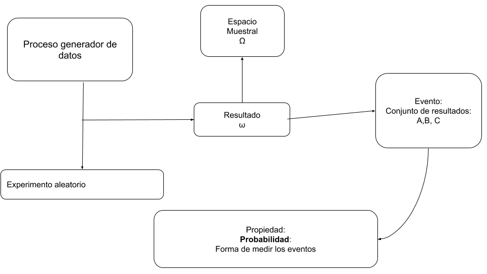
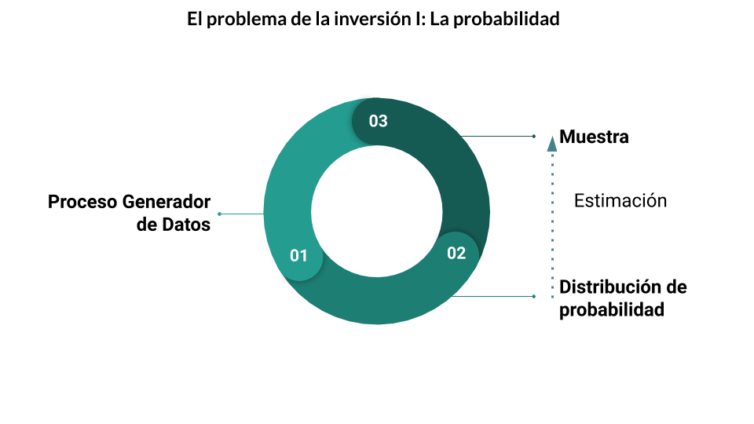
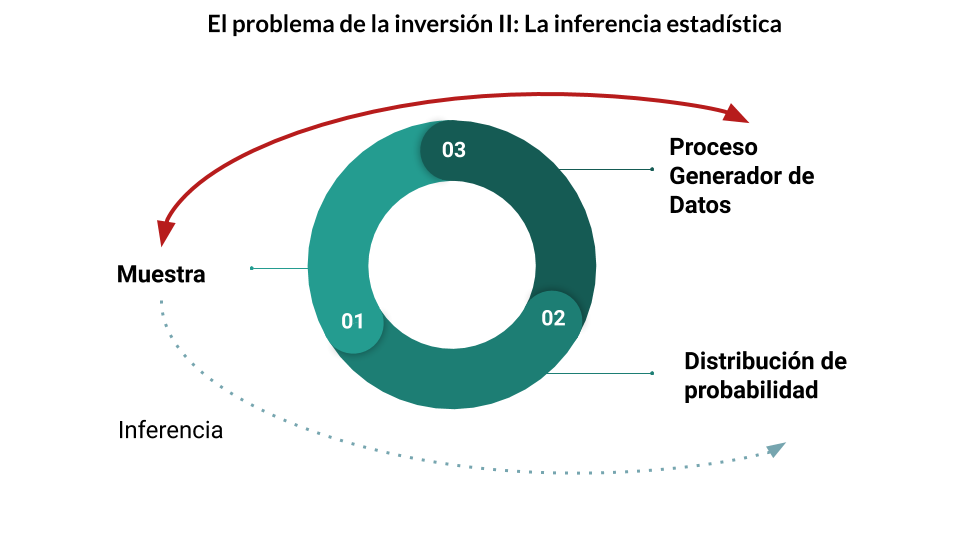
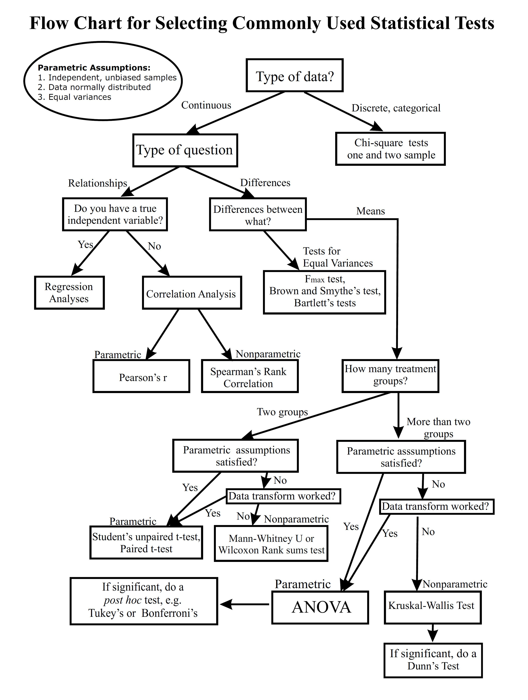

# Probabilidad y Estadística
## Explicación

```{r setup, include = FALSE}
knitr::opts_chunk$set(warning = FALSE, message = FALSE,echo=FALSE, fig.width = 15)
library(tidyverse)
library(kableExtra)
library(cowplot)
set.seed(12)
```


### Probabilidad

Previo a estudiar las herramientas de la estadística descriptiva, es necesario hacer un breve resumen de algunos conceptos fundamentales de probabilidad


#### Marco conceptual

{width=1000}


- El análisis de las probabilidades parte de un __proceso generador de datos__ entendido como cualquier fenómeno que produce algún tipo de información de forma sistemática. 
- Cada iteración de este proceso produce información, que podemos interpretar como un __resultado__. 
- Existe un conjunto de posibles resultados, que definimos como __espacio muestral__.
- Un __evento__ es el conjunto de resultados ocurridos.
- En este marco, la __probabilidad__ es un atributo de los eventos. Es la forma de medir los eventos tal que, siguiendo la definición moderna de probabilidad:

A) $P(A) \geq 0 \forall \ A \subseteq \Omega$
A) $P(\Omega)=1$
A) $P(A\cup B) = P(A) + P(B)\ si\ A \cap B = \emptyset$


> ejemplo, tiramos un dado y sale tres

- Espacio muestral: 1,2,3,4,5,6
- Resultado: 3
- Evento: impar (el conjunto 1,3,5)


#### Distribución de probabilidad

- La distribución de probabilidad hace referencia a los posibles valores teóricos de cada uno de los resultados pertenecientes al espacio muestral.

- Existen dos tipos de distribuciones, dependiendo si el espacio muestral es o no numerable.

##### Distribuciones discretas

Sigamos con el ejemplo de dado. 

Podríamos definir la distribución de probabilidad, si no esta cargado, cómo:

```{r echo=FALSE, message=FALSE, warning=FALSE}
tibble(valor=1:6, probabilidad=rep("1/6", 6))
```

Cómo el conjunto de resultados posibles es acotado, podemos definirlo en una tabla, esta es una distribución _discreta_

##### Distribuciones continuas

¿Qué pasa cuando el conjunto de resultados posibles es tan grande que no se puede enumerar la probabilidad de cada caso?

Si, por definición o por practicidad, no se puede enumerar cada caso, lo que tenemos es una __distribución continua__

> Por ejemplo, la altura de la población

```{r}

ggplot(data = data.frame(x = c(114, 234)), aes(x)) +
  stat_function(fun = dnorm, n = 1000, args = list(mean = 174, sd = 30)) + 
  labs(x='altura',y="") +
  scale_y_continuous(breaks = NULL)+
  scale_x_continuous(breaks = c(144,174,204))+
  theme_minimal()+
  theme(text = element_text(size = 18))
```

- En este caso, no podemos definir en una tabla la probabilidad de cada uno de los posibles valores. _de hecho, la probabilidad puntual es 0_. 

- Sin embargo, sí podemos definir una _función de probabilidad_, la _densidad_.

- Según qué función utilicemos, cambiara la forma de la curva.


Por ejemplo:

```{r}

ggplot(data = data.frame(x = c(-2,2)), aes(x)) +
  stat_function(fun = dnorm, n = 1000, args = list(mean = 0, sd = 1)) + 
  labs(x='',y="", title = "Distribución Normal") +
  scale_y_continuous(breaks = NULL)+
  scale_x_continuous(breaks = c(-1,0,1))+
  theme_minimal()+
  theme(text = element_text(size = 18))

ggplot(data = data.frame(x = c(-2, 2)), aes(x)) +
  stat_function(fun = dt, n = 1000, args = list(df=1)) + 
  labs(x='',y="", title = "Distribución t")+
  scale_y_continuous(breaks = NULL)+
  scale_x_continuous(breaks = c(-1,0,1))+
  theme_minimal()+
  theme(text = element_text(size = 18))

ggplot(data = data.frame(x = c(0, 10)), aes(x)) +
  stat_function(fun = dchisq, n = 1000, args = list(df=3)) + 
  labs(x='altura',y="", title = "Distribución Chi cuadrado")+
  scale_y_continuous(breaks = NULL)+
  scale_x_continuous(breaks = c(1:10))+
  theme_minimal()+
  theme(text = element_text(size = 18))

```

> Una distribución de probabilidad se __caracteriza__ por sus _parámetros_.

- Por ejemplo, la distribución normal se caracteriza por su _esperanza_ y su _varianza_ (o desvío estándar)

```{r}

ggplot(data = data.frame(x = c(-10,10)), aes(x)) +
  stat_function(fun = dnorm, n = 1000, args = list(mean = 0, sd = 1)) + 
  labs(x='',y="", title = "Distribución Normal",
       subtitle = 'media = 0, desvío estándar = 1') +
  scale_y_continuous(breaks = NULL)+
  scale_x_continuous(breaks = seq(-10,10,2))+
  theme_minimal()+
  theme(text = element_text(size = 18))

ggplot(data = data.frame(x = c(-10,10)), aes(x)) +
  stat_function(fun = dnorm, n = 1000, args = list(mean = 0, sd = 3)) + 
  labs(x='',y="", title = "Distribución Normal",
       subtitle = 'media = 0, desvío estándar = 3') +
  scale_y_continuous(breaks = NULL)+
  scale_x_continuous(breaks = seq(-10,10,2))+
  theme_minimal()+
  theme(text = element_text(size = 18))

ggplot(data = data.frame(x = c(-10,10)), aes(x)) +
  stat_function(fun = dnorm, n = 1000, args = list(mean = 5, sd = 1)) + 
  labs(x='',y="", title = "Distribución Normal",
       subtitle = 'media = 5, desvío estándar = 1') +  
  scale_y_continuous(breaks = NULL)+
  scale_x_continuous(breaks = seq(-10,10,2))+
  theme_minimal()+
  theme(text = element_text(size = 18))


```


### Estadística
#### El problema de la inversión


El problema de la probabilidad se podría pensar de la siguiente forma:

1. Vamos a partir de un __proceso generador de datos__
1. para calcular su __distribución de probabilidad__, los __parámetros__ que caracterizan a ésta, y a partir de allí, 
1. calcular la probabilidad de que, al tomar una __muestra__, tenga ciertos eventos.

{width=1000}

El problema de la estadística es exactamente el contrario:

1. Partimos de una __muestra__ para
1. inferir cuál es la __distribución de probabilidad__, y los __parámetros__ que la caracterizan
1. para finalmente poder sacar conclusiones sobre el __proceso generador de datos__

{width=1000}


##### Población y muestra

En este punto podemos hacer la distinción entre __población__ y __muestra__

- __Población__: El universo en estudio. Puede ser:
  - finita: Los votantes en una elección.
  - infinita: El lanzamiento de una moneda.
- __Muestra__: subconjunto de  n observaciones de una población.

Solemos utilizar las mayúsculas (N) para la población y las minúsculas (n) para las muestras

##### Parámetros y Estimadores

- Como dijimos, los __parámetros__ describen a la función de probabilidad. Por lo tanto hacen referencia a los atributos de la __población__. Podemos suponer que son _constantes_
- Un __estimador__ es un estadístico (esto es, una función de la muestra) usado para estimar un parámetro desconocido de la población.

##### Ejemplo. La media

Esperanza o Media Poblacional:

$$
\mu = E(x)= \sum_{i=1}^N x_ip(x_i)
$$

Media muestral: 

$$
\bar{X}= \sum_{i=1}^n \frac{Xi}{n}
$$

Como no puedo conocer $\mu$, lo estimo mediante $\bar{X}$


#### Estimación puntual, Intervalos de confianza y Tests de hipótesis

- El estimador $\bar{X}$ nos devuelve un número. Esto es una inferencia de cuál creemos que es la media. Pero no es seguro de que esa sea realmente la media. Esto es lo que denominamos estimación puntual

- También podemos estimar un intervalo, dentro del cual consideramos que se encuentra la media poblacional. La ventaja de esta metodología es que podemos definir la probabilidad de que el parámetro poblacional realmente este dentro de este intervalo. Esto se conoce como __intervalos de confianza__

- Por su parte, también podemos calcular la probabilidad de que el parámetro poblacional sea mayor, menor o igual a un cierto valor. Esto es lo que se conoce como __test de hipótesis__.

- En el fondo, los intervalos de confianza y los tests de hipótesis se construyen de igual manera. Son funciones que se construyen a partir de los datos, que se comparan con distribuciones conocidas, _teóricas_. 

##### Definición de los tests

- Los tests se construyen con dos hipótesis: La hipótesis nula $H_0$, y la hipótesis alternativa, $H_1$. Lo que buscamos es ver si _hay evidencia suficiente para rechazar la hipótesis nula_.

Por ejemplo, si queremos comprobar si la media poblacional, $\mu$ de una distribución es mayor a $X_i$, haremos un test con las siguientes hipótesis:

- $H_0: \mu = X_i$
- $H_1: \mu > X_i$

Si la evidencia es lo suficientemente fuerte, podremos rechazar la hipótesis $H_0$, _pero no afirmar la hipótesis $H_1$_

##### Significatividad en los tests

- Muchas veces decimos que algo es __"estadística mente significativo"__. Detrás de esto se encuentra un test de hipótesis que indica que hay una suficiente _significativdad estadística_. 

- La _significatividad estadística_,representada con $\alpha$, es la probabilidad de rechazar $H_0$ cuando en realidad es cierta. Por eso, cuanto más bajo el valor de $\alpha$, más seguros estamos de no equivocarnos. Por lo general testeamos con valores de alpha de 1%, 5% y 10%, dependiendo del área de estudio


- El __p-valor__ es _la mínima significatividad para la que rechazo el test. Es decir, cuanto más bajo es el p-valor, más seguros estamos de rechazar $H_0$


- El resultado de un test esta determinado por

  1. __La fuerza evidencia empírica__: Si nuestra duda es si la media poblacional es mayor a, digamos, 10. Y la media muestral es 11, no es es lo mismo que si es 100, 1000 o 10000.
  1. __El tamaño de la muestra__: En las fórmulas que definen los test siempre juega el tamaño de la muestra: cuanto más grande es, más seguros estamos de que el resultado no es producto del mero azar.
  1. __La veracidad de los supuestos__: Otra cosa importante es que los test asumen ciertas cosas: 
    - Normalidad en los datos.
    - Que conocemos algún otro parámetro de la distribución, como la varianza.
    - Que los datos son independientes entre sí,
    - Etc. \
__Cada Test tiene sus propios supuestos__. Por eso a veces luego de hacer un test, hay que hacer otros tests para validar que los supuestos se cumplen. 


- Lo primero, la fuerza de la evidencia, es lo que más nos importa, y no hay mucho por hacer. 

- El tamaño de la muestra es un problema, porque si la muestra es muy chica, entonces podemos no llegar a conclusiones significativas aunque sí ocurra aquello que queríamos probar. 

- Sin embargo, el verdadero problema en _La era del big data_ es que tenemos muestras demasiado grandes, por lo que cualquier test, por más mínima que sea la diferencia, puede dar significativo.

> Por ejemplo, podemos decir que la altura promedio en Argentina es 1,74. Pero si hacemos un test, utilizando como muestra 40 millones de personas, vamos a rechazar que ese es el valor, porque en realidad es 1,74010010. En términos de lo que nos puede interesar, 1,74 sería válido, pero estadísticamente rechazaríamos. 

- Finalmente, según la información que tengamos de la población y cual es el problema que queremos resolver, vamos a tener que utilizar distintos tipos de tests. La cantidad de tests posibles es ENORME, y escapa al contenido de este curso, así como sus fórmulas. A modo de ejemplo, les dejamos el siguiente machete:

{width=1000}


### Algunos estimadores importantes

#### Medidas de centralidad
- __Media__

$$
\bar{X}= \sum_{i=1}^n \frac{Xi}{n}
$$


- __Mediana__:

Es el valor que parte la distribución a la mitad


- __Moda__

La moda es el valor más frecuente de la distribución


```{r echo=FALSE}
df=3
mean = df
median <- qchisq(p = 0.5,df = df)
mode <- max(df-2,0)

cortes <- round(c(mean, median, mode),2)
etiquetas <- c('media', 'mediana', 'moda')

ggplot(data = data.frame(x = c(0, 10)), aes(x)) +
  stat_function(fun = dchisq, n = 1000, args = list(df=df)) + 
  labs(x='',y="", title = "")+
  scale_y_continuous(breaks = NULL)+
  scale_x_continuous(breaks = cortes, labels = etiquetas)+
  theme_minimal()+
  theme(panel.grid.minor = element_blank(),
        text = element_text(size = 18),
        axis.text.x = element_text(face = 'bold', angle = 45))
```


#### Cuantiles


Así como dijimos que la mediana es el valor que deja al 50% de los datos de un lado y al 50% del otro, podemos generalizar este concepto a cualquier X%. Esto son los cuantiles. El cuantil x, es el valor tal que queda un x% de la distribución a izquierda, y 1-x a derecha. 

Algunos de los más utilizados son el del 25%, también conocido como $Q_1$ (el _cuartil_ 1), el $Q_2$ (la mediana) y el $Q_3$ (el _cuartil_ 3), que deja el 75% de los datos a su derecha. Veamos como se ven en la distribución de arriba


```{r}

df=3
Q1 <- qchisq(p = 0.25,df = df)
Q2 <- qchisq(p = 0.5,df = df)
Q3 <- qchisq(p = 0.75,df = df)

cortes <- round(c(Q1,Q2,Q3),2)
etiquetas <- c("Q1","Q2","Q3")


ggplot(data = data.frame(x = c(0, 10)), aes(x)) +
  stat_function(fun = dchisq, n = 1000, args = list(df=df)) + 
  labs(x='',y="", title = "")+
  scale_y_continuous(breaks = NULL)+
  scale_x_continuous(breaks = cortes, labels = etiquetas)+
  theme_minimal()+
  theme(panel.grid.minor = element_blank(),
        axis.text.x = element_text(size = 12, face = 'bold', angle = 45),
        text = element_text(size = 18))
```


#### desvío estándar
- El _desvío estándar_ es una medida de dispersión de los datos, que indica cuánto se suelen alejar de la media. 


### Gráficos estadísticos

Cerramos la explicación con algunos gráficos que resultan útiles para entender las propiedades estadísticas de los datos.

#### Boxplot

El Boxplot es muy útil para describir una distribución y para detectar outliers. Reúne los principales valores que caracterizan a una distribución:

- $Q_1$
- $Q_2$ (la mediana)
- $Q_3$
- el _rango intercuarítlico_ $Q_3 - Q_1$, que define el centro de la distribución
- Outliers, definidos como aquellos puntos que se encuentran a más de 1,5 veces el rango intercuartílico del centro de la distribución.


veamos qué pinta tienen los boxplot de números generados aleatoriamente a partir de tres distribuciones que ya vimos. En este caso, sólo tomaremos 15 valores de cada distribución

```{r}


distribuciones <- tibble(
Normal = rnorm(n = 15,mean = 0, sd = 1 ),
`T-student` = rt(n = 15,df=1 ),
Chi = rchisq(n = 15,df=1)) %>% 
  gather(distribucion, valor)

ggplot(data = distribuciones, aes(distribucion, valor, fill=distribucion)) +
  geom_boxplot()+
  labs(x='',y="", title = "Boxplot") +
  facet_wrap(.~distribucion, scales = "free_x")+
  theme_minimal()+
  theme(legend.position = 'none',
        axis.text.x = element_blank(),
        text = element_text(size = 18))

```

Algunas cosas que resaltan:

- la distribución $\chi^2$ no toma valores en los negativos.
- La normal esta más concentrada en el centro de la distribución


Podemos generar 100 números aleatorios en lugar de 15: 

```{r}

distribuciones <- tibble(
Normal = rnorm(n = 100,mean = 0, sd = 1 ),
`T-student` = rt(n = 100,df=1 ),
Chi = rchisq(n = 100,df=1)) %>% 
  gather(distribucion, valor)

ggplot(data = distribuciones, aes(distribucion, valor, fill=distribucion)) +
  geom_boxplot()+
  labs(x='',y="", title = "Boxplot") +
  facet_wrap(.~distribucion, scales = "free_x")+
  theme_minimal()+
  theme(legend.position = 'none',
        axis.text.x = element_blank(),
        text = element_text(size = 18))

```

Cuando generamos 100 valores en lugar de 15, tenemos más chances de agarrar un punto alejado en la distribución. De esta forma podemos apreciar las diferencias entre la distribución normal y la T-student.


También podemos volver a repasar qué efecto generan los distintos parámetros. Por ejemplo

```{r}
distribuciones <- tibble(
`Media 0, ds=1` = rnorm(n = 100,mean = 0, sd = 1 ),
`Media 0, ds=2` = rnorm(n = 100,mean = 0, sd = 2 ),
`Media 5, ds=1` = rnorm(n = 100,mean = 5, sd = 1 )) %>% 
  gather(distribucion, valor)

ggplot(data = distribuciones, aes(distribucion, valor, fill=distribucion)) +
  geom_boxplot()+
  labs(x='',y="", title = "Distribución normal") +
  facet_wrap(.~distribucion, scales = "free_x")+
  theme_minimal()+
  theme(legend.position = 'none',
        axis.text.x = element_blank(),
        text = element_text(size = 18))
```


#### Histograma

Otra forma de analizar una distribución es mediante los histogramas:

- En un histograma agrupamos las observaciones en rangos fijos de la variable y contamos la cantidad de ocurrencias.
- Cuanto más alta es una barra, es porque más observaciones se encuentran en dicho rango

Veamos el mismo ejemplo que arriba, pero con histogramas

```{r}
distribuciones <- tibble(
Normal = rnorm(n = 15,mean = 0, sd = 1 ),
`T-student` = rt(n = 15,df=1 ),
Chi = rchisq(n = 15,df=1)) %>% 
  gather(distribucion, valor)

ggplot(data = distribuciones, aes( x=valor, fill=distribucion)) +
  geom_histogram(bins = 10)+
  labs(x='',y="", title = "Histograma") +
  facet_grid(distribucion~.)+
  theme_minimal()+
  theme(legend.position = 'none',
        axis.text.y = element_blank(),
        text = element_text(size = 18))


distribuciones <- tibble(
`Media 0, ds=1` = rnorm(n = 100,mean = 0, sd = 1 ),
`Media 0, ds=2` = rnorm(n = 100,mean = 0, sd = 2 ),
`Media 5, ds=1` = rnorm(n = 100,mean = 5, sd = 1 )) %>% 
  gather(distribucion, valor)

ggplot(data = distribuciones, aes( x=valor, fill=distribucion)) +
  geom_histogram(bins = 20)+
  labs(x='',y="", title = "Distribución normal") +
  facet_grid(distribucion~.)+
  theme_minimal()+
  theme(legend.position = 'none',
        axis.text.y = element_blank(),
        text = element_text(size = 18))
```


#### Kernel

Los Kernels son simplemente un suavizados sobre los histogramas


```{r}
distribuciones <- tibble(
Normal = rnorm(n = 15,mean = 0, sd = 1 ),
`T-student` = rt(n = 15,df=1 ),
Chi = rchisq(n = 15,df=1)) %>% 
  gather(distribucion, valor)

ggplot(data = distribuciones, aes( x=valor, fill=distribucion)) +
  geom_density(bins = 10)+
  labs(x='',y="", title = "Histograma") +
  facet_grid(distribucion~.)+
  theme_minimal()+
  theme(legend.position = 'none',
        axis.text.y = element_blank(),
        text = element_text(size = 18))


distribuciones <- tibble(
`Media 0, ds=1` = rnorm(n = 100,mean = 0, sd = 1 ),
`Media 0, ds=2` = rnorm(n = 100,mean = 0, sd = 2 ),
`Media 5, ds=1` = rnorm(n = 100,mean = 5, sd = 1 )) %>% 
  gather(distribucion, valor)

ggplot(data = distribuciones, aes( x=valor, fill=distribucion)) +
  geom_density(bins = 20)+
  labs(x='',y="", title = "Distribución normal") +
  facet_grid(distribucion~.)+
  theme_minimal()+
  theme(legend.position = 'none',
        axis.text.y = element_blank(),
        text = element_text(size = 18))
```

#### Violin plots

Combinando la idea de Kernels y boxplots, se crearon los violin plots, que simplemente muestran a los kernels duplicados

```{r}
distribuciones <- tibble(
Normal = rnorm(n = 15,mean = 0, sd = 1 ),
`T-student` = rt(n = 15,df=1 ),
Chi = rchisq(n = 15,df=1)) %>% 
  gather(distribucion, valor)

ggplot(data = distribuciones, aes(distribucion, valor, fill=distribucion)) +
  geom_violin(alpha=0.75)+
  geom_boxplot(alpha=0.5)+
  labs(x='',y="", title = "Boxplot") +
  facet_wrap(.~distribucion, scales = "free_x")+
  theme_minimal()+
  theme(legend.position = 'none',
        axis.text.x = element_blank(),
        text = element_text(size = 18))


distribuciones <- tibble(
`Media 0, ds=1` = rnorm(n = 100,mean = 0, sd = 1 ),
`Media 0, ds=2` = rnorm(n = 100,mean = 0, sd = 2 ),
`Media 5, ds=1` = rnorm(n = 100,mean = 5, sd = 1 )) %>% 
  gather(distribucion, valor)

ggplot(data = distribuciones, aes(distribucion, valor, fill=distribucion)) +
  geom_violin(alpha=0.75)+
  geom_boxplot(alpha=0.5)+
  geom_boxplot()+
  labs(x='',y="", title = "Distribución normal") +
  facet_wrap(.~distribucion, scales = "free_x")+
  theme_minimal()+
  theme(legend.position = 'none',
        axis.text.x = element_blank(),
        text = element_text(size = 18))
```


### Bibliografía de consulta

Quién quiera profundizar en estos temas, puede ver los siguientes materiales:

- https://seeing-theory.brown.edu/
- https://lagunita.stanford.edu/courses/course-v1:OLI+ProbStat+Open_Jan2017/about
- Jay L. Devore, “Probabilidad y Estadística para Ingeniería y Ciencias”, International Thomson Editores. https://inferencialitm.files.wordpress.com/2018/04/probabilidad-y-estadistica-para-ingenieria-y-ciencias-devore-7th.pdf

