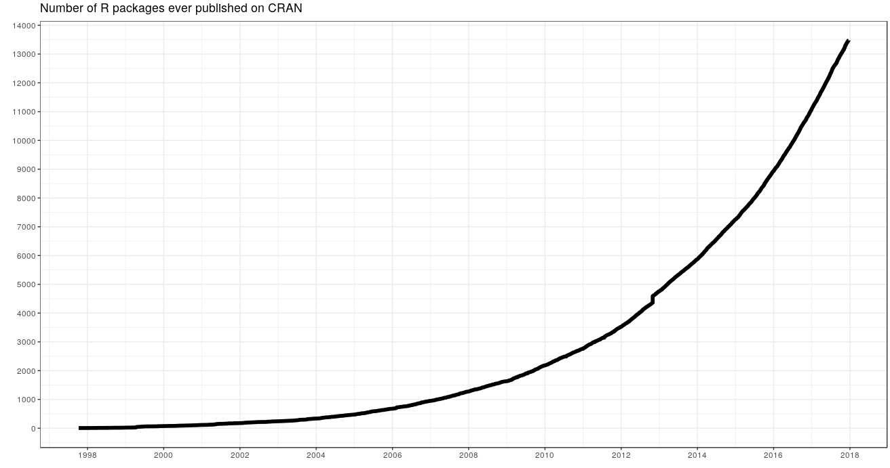
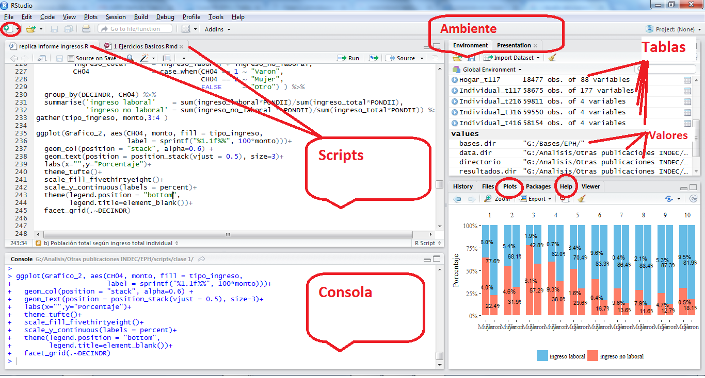

--- 
title: "Notas de clase del curso de introducción a Data Science"
author: "Diego Kozlowski y Natsumi Shokida"
date: "`r Sys.Date()`"
site: bookdown::bookdown_site
documentclass: book
bibliography: [book.bib, packages.bib]
biblio-style: apalike
link-citations: yes
description: "desarrollado para el Min. de Transporte (Argentina)"
---

# Temario

- __clase 1__: Introducción al entorno R
- __clase 2__: Tidyverse. (limpieza y organización de datos)
- __clase 3__: Visualización de la información
- __clase 4__: Estadística descriptiva
- __clase 5__:
- __clase 6__:
- __clase 7__:
- __clase 8__:
- __clase 9__:
- __clase 10__:


#### Librerias a instalar

```
install.packages(c("tidyverse","openxlsx",'ggplot2','ggthemes', 'ggrepel','ggalt','kableExtra','GGally','ggridges','fs','purrr','rmarkdown'))
```

<!--chapter:end:index.Rmd-->

# Introducción a R
## Explicación

{width=1000}

### ¿Que es R?

- Lenguaje para el procesamiento y análisis estadístico de datos
- Software Libre
- Sintaxis Básica: R base 
- Sintaxis incremental[^1]: El lenguaje se va ampliando por aportes de Universidades, investigadores/as, usuarios/as y empresas privadas, organizados en librerías (o paquetes)
- Comunidad web muy grande para realizar preguntas y despejar dudas.
- Graficos con calidad de publicación

[^1]: Más allá de los comandos elementales, comandos más sofisticados tienen muchas versiones, y algunas quedan en desuso en el tiempo.

{width=1000}


{width=1000}

El _entorno_ más cómodo para utilizar el _lenguaje_ __R__ es el _programa_ __R studio__

- Rstudio es una empresa que produce productos asociados al lenguaje R, como el programa sobre el que corremos los comandos, y extensiones del lenguaje (librerías).
 
- El programa es _gratuito_ y se puede bajar de la 
[página oficial](https://www.rstudio.com/) 


{width=1000}


### Lógica sintáctica.

#### Definición de objetos
Los __Objetos/Elementos__ constituyen la categoría escencial del R. De hecho, todo en R es un objeto, y se almacena con un nombre específico que **no debe poseer espacios**. Un número, un vector, una función, la progresión de letras del abecedario, una base de datos, un gráfico, constituyen para R objetos de distinto tipo. Los objetos que vamos creando a medida que trabajamos pueden visualizarse en la panel derecho superior de la pantalla. 

El operador __```<-```__ sirve para definir un objeto.  __A la izquierda__ del __```<-```__ debe ubicarse el nombre que tomará el elemento a crear. __Del lado derecho__ debe ir la definición del mismo


```{r}
A <- 1
```

Al definir un elemento, el mismo queda guardado en el ambiente del programa, y podrá ser utilizado posteriormente para observar su contenido o para realizar una operación con el mismo

```{r}
A 
A+6
```

Al correr una linea con el nombre del objeto, la consola del programa nos muestra su contenido. Entre Corchetes Observamos el número de orden del elemento en cuestión

El operador __```=```__ es __equivalente__ a __```<-```__, pero en la práctica no se utiliza para la definición de objetos.   

```{r}
B = 2
B
```

__```<-```__ es un operador __Unidireccional__, es decir que:     
```A <- B``` implica que __A__ va tomar como valor el contenido del objeto __B__, y no al revés.
```{r}
A <- B
A   #Ahora A toma el valor de B, y B continua conservando el mismo valor
B
```


### R base

Con _R base_ nos referimos a los comandos básicos que vienen incorporados en el R, sin necesidad de cargar librerías. 

#### Operadores lógicos: 

- $>$
- $>=$
- $<$
- $<=$
- $==$
- $!=$

```{r}
#Redefinimos los valores A y B
A <-  10
B  <-  20
#Realizamos comparaciones lógicas

A >  B
A >= B
A <  B
A <= B
A == B
A != B

C <- A != B
C
```

Como muestra el último ejemplo, el resultado de una operación lógica puede almacenarse como el valor de un objeto.

#### Operadores aritméticos:

```{r}
#suma
A <- 5+6
A
#Resta
B <- 6-8
B
#cociente
C <- 6/2.5
C
#multiplicacion
D <- 6*2.5
D
```

#### Funciones:
Las funciones son series de procedimientos estandarizados, que toman como imput determinados argumentos a fijar por el usuario, y devuelven un resultado acorde a la aplicación de dichos procedimientos. Su lógica de funcionamiento es:   
```funcion(argumento1 = arg1, argumento2 = arg2)```      

A lo largo del curso iremos viendo numerosas funciones, según lo requieran los distintos ejercicios. Sin embargo, veamos ahora algunos ejemplos para comprender su funcionamiento:    

- paste() : concatena una serie de caracteres, indicando por última instancia como separar a cada uno de ellos        
- paste0(): concatena una serie de caracteres sin separar
- sum(): suma de todos los elementos de un vector   
- mean() promedio aritmético de todos los elementos de un vector   

```{r}
paste("Pega","estas",4,"palabras", sep = " ")

#Puedo concatenar caracteres almacenados en objetos
paste(A,B,C,sep = "**")

# Paste0 pega los caracteres sin separador
paste0(A,B,C)

1:5

sum(1:5)
mean(1:5,na.rm = TRUE)
```


#### Caracteres especiales

- R es sensible a mayúsculas y minúsculas, tanto para los nombres de las variables, como para las funciones y parámetros.
- Los __espacios en blanco__ y los __carriage return__ (_enter_) no son considerados por el lenguaje. Los podemos aprovechar para emprolijar el código y que la lectura sea más simple[^2].

[^2]: veremos que existen ciertas excepciones con algunos paquetes más adelante. 

- El __numeral__ ```#``` se utiliza para hacer comentarios. Todo lo que se escribe después del # no es interpretado por R. Se debe utilizar un # por cada línea de código que se desea anular

- Los __corchetes__ ```[]``` se utilizan para acceder a un objeto:
    - en un vector[n° orden]
    - en una tabla[fila, columna]
    - en una lista[n° elemento]
- el signo __$__ también es un método de acceso. Particularmente, en los dataframes, nos permitira acceder a una determinada columna de una tabla

- Los __paréntesis__```()``` se utilizan en las funciones para definir los parámetros.

- Las __comas__ ```, ```  se utilizan para separar los parametros al interior de una función. 

### Objetos:    
Existen un gran cantidad de objetos distintos en R, en lo que resepcta al curso trabajaremos principalmente con 3 de ellos:

- Valores
- Vectores
- Data Frames
- Listas

#### Valores
Los valores y vectores pueden ser a su vez de distintas _clases_:   

__Numeric__     

```{r}
A <-  1
class(A)
```


__Character__
```{r}
A <-  paste('Soy', 'una', 'concatenación', 'de', 'caracteres', sep = " ")
A
class(A)
```


__Factor__
```{r}
A <- factor("Soy un factor, con niveles fijos")
class(A)
```

La diferencia entre un _character_ y un _factor_ es que el último tiene solo algunos valores permitidos (levels), con un orden interno predefinido (el cual ,por ejemplo, se respetará a la hora de realizar un gráfico)  


#### Vectores

Para crear un __vector__ utilizamos el comando ```c()```, de combinar.

```{r}
C <- c(1, 3, 4)
C
```

sumarle  2 a cada elemento del __vector__ anterior

```{r}
C <- C + 2
C
```

sumarle  1 al primer elemento, 2 al segundo, y 3 al tercer elemento del __vector__ anterior
```{r}
D <- C + 1:3 #esto es equivalente a hacer 3+1, 5+2, 6+9 
D
```

```1:3``` significa que queremos todos los números enteros desde 1 hasta 3. 

crear un __vector__ que contenga las palabras: "Carlos","Federico","Pedro"
```{r}
E <- c("Carlos","Federico","Pedro")
E
```

para acceder a algún elemento del vector, podemos buscarlo por su número de orden, entre ```[ ]```

```{r}
 E[2]

```

Si nos interesa almacenar dicho valor, al buscarlo lo asignamos a un nuevo objeto, dandole el nombre que deseemos

```{r}
elemento2 <-  E[2]
```
```{r}
elemento2
```

para __borrar__ un objeto del ambiente de trabajo, utilizamos el comando _```rm()```_

```{r error=TRUE}
rm(elemento2)
elemento2
```

También podemos cambiar el texto del segundo elemento de E, por el texto "Pablo"

```{r}
E[2] <- "Pablo"
E
```

### Data Frames

Un Data Frame es una tabla de datos, donde cada columna representa una variable, y cada fila una observación.

Este objeto suele ser central en el proceso de trabajo, y suele ser la forma en que se cargan datos externos para trabajar en el ambiente de R, y en que se exportan los resultados de nuestros trabajo.  

También Se puede crear como la combinación de N vectores de igual tamaño. Por ejemplo, tomamos algunos valores del [Indice de salarios](http://www.indec.gob.ar/bajarCuadroEstadistico.asp?idc=4020B33440609462654542BD0BC320F1523DA0DC52C396201DB4DD5861FFEDC9AD1436681AC84179)

```{r}
INDICE  <- c(100,   100,   100,
             101.8, 101.2, 100.73,
             102.9, 102.4, 103.2)

FECHA  <-  c("Oct-16", "Oct-16", "Oct-16",
             "Nov-16", "Nov-16", "Nov-16",
             "Dic-16", "Dic-16", "Dic-16")


GRUPO  <-  c("Privado_Registrado","Público","Privado_No_Registrado",
             "Privado_Registrado","Público","Privado_No_Registrado",
             "Privado_Registrado","Público","Privado_No_Registrado")
             

Datos <- data.frame(INDICE, FECHA, GRUPO)
Datos
```

Tal como en un __vector__ se ubica a los elementos mediante ```[ ]```, en un __dataframe__ se obtienen sus elementos de la forma __```[fila, columna]```__.

Otra opción es especificar la columna, mediante el operador __```$```__, y luego seleccionar dentro de esa columna el registro deseado mediante el número de orden.

```{r}
Datos$FECHA
Datos[3,2]
Datos$FECHA[3]
```

¿que pasa si hacemos ```Datos$FECHA[3,2]``` ?

```{r error=TRUE}
Datos$FECHA[3,2]
```
Nótese que el último comando tiene un número incorrecto de dimensiones, porque estamos refiriendonos 2 veces a la columna FECHA.    

Acorde a lo visto anteriormente, el acceso a los __dataframes__ mediante  ```[ ]```, puede utilizarse para realizar filtros sobre la base, especificando una condición para las filas. Por ejemplo, puedo utilizar los  ```[ ]``` para conservar del __dataframe__ ```Datos ```  unicamente los registros con fecha de Diciembre 2016:
```{r error=TRUE}
Datos[Datos$FECHA=="Dic-16",]
```
La lógica del paso anterior sería: Accedo al dataframe ```Datos```, pidiendo únicamente conservar las filas (por eso la condición se ubica a la _izquierda_ de la  ```, ```) que cumplan el requisito de pertenecer a la categoría __"Dic-16"__ de la variable __FECHA__.      
Aún más, podría aplicar el filtro y al mismo tiempo identificar una variable de interés para luego realizar un cálculo sobre aquella. Por ejemplo, podría calcular la media de los indices en el mes de Diciembre. 
```{r error=TRUE}
###Por separado
Indices_Dic <- Datos$INDICE[Datos$FECHA=="Dic-16"]
Indices_Dic
```
```{r error=TRUE}
mean(Indices_Dic)
```
```{r error=TRUE}
### Todo junto
mean(Datos$INDICE[Datos$FECHA=="Dic-16"])
```
La lógica de esta sintaxis sería: "Me quedó con la variable __INDICE__, cuando la variable FECHA sea igual a __"Dic-16"__, luego calculo la media de dichos valores"

### Listas

Contienen una concatenación de objetos de cualquier tipo. Así como un vector contiene valores, un dataframe contiene vectores, una lista puede contener dataframes, pero también vectores, o valores, y _todo ello a la vez_

```{r}
superlista <- list(A,B,C,D,E,FECHA, DF = Datos, INDICE, GRUPO)
superlista
```

Para acceder un elemento de una lista, podemos utilizar el operador __```$```__, que se puede usar a su vez de forma iterativa 

```{r}
superlista$DF$FECHA[2]
```

### Ambientes de trabajo

Hay algunas cosas que tenemos que tener en cuenta respecto del orden del ambiente en el que trabajamos:

- Working Directory: El directorio de trabajo, pueden ver el suyo con `getwd()`, es *hacia donde apunta el código*, por ejemplo, si quieren leer un archivo, la ruta del archivo tiene que estar explicitada como el recorrido desde el Working Directory.
- Environment: Esto engloba tanto la información que tenemos cargada en *Data* y *Values*, como las librerías que tenemos cargadas mientras trabajamos. 

Es importante que mantengamos bien delimitadas estas cosas entre diferentes trabajos, sino:

1. El directorio queda referido a un lugar específico en nuestra computadora. 
  - Si se lo compartimos a otro **se rompe**
  - Si cambiamos de computadora **se rompe**
  - Si lo cambiamos de lugar **se rompe**
  - Si primero abrimos otro script **se rompe**
2. Tenemos mezclados resultados de diferentes trabajos:
  - Nunca sabemos si esa variable/tabla/lista se creo en ese script y no otro
  - Perdemos espacio de la memoria
  - No estamos seguros de que el script cargue todas las librerías que necesita

Rstudio tiene una herramienta muy útil de trabajo que son los **proyectos**. Estos permiten mantener un ambiente de trabajo delimitado por cada uno de nuestros trabajos. Es decir:

- El directorio de trabajo se refiere a donde esta ubicado el archivo .Rproj
- El Environment es específico de nuestro proyecto.

Un proyecto no es un sólo script, sino toda una carpeta de trabajo. 

{width=1000}

Para crearlo, vamos al logo de nuevo projecto (Arriba a la izquierda de la panatalla), y elegimos la carpeta de trabajo. 


### Tipos de archivos de R

- __Script__: Es un archivo de texto plano, donde podemos poner el código que utilizamos para preservarlo
- __Rnotebook__: También sirve para guardar el código, pero a diferencia de los scripts, se puede compilar, e intercalar código con resultados (este archivo es un rnotebook)
- __Rproject__: Es un archivo que define la metadata del proyecto
- __RDS y Rdata__: Dos formatos de archivos propios de R para guardar datos. 

<!--chapter:end:01_explicacion.Rmd-->


## Práctica Guiada

### Instalación de paquetes complementarios al R Base          

Hasta aquí hemos visto múltiples funciones que están contenidas dentro del lenguaje básico de R. Ahora bien, al tratarse de un software libre, los usuarios de R con más experiencia contribuyen sistemáticamente a expandir este lenguaje mediante la creación y actualización de __paquetes__ complementarios. Lógicamente, los mismos no están incluidos en la instalación inicial del programa, pero podemos descargarlos e instalarlos al mismo tiempo con el siguiente comando:   
``` 
install.packages("nombre_del_paquete") 
```
Resulta recomendable __ejecutar este comando desde la consola__ ya que solo necesitaremos correrlo una vez en nuestra computadora. Al ejecutar el mismo, se descargarán de la pagina de [CRAN](www.cran.r-project.org) los archivos correspondientes al paquete hacia el directorio en donde hayamos instalado el programa. Típicamente los archivos se encontrarán en __`C:\Program Files\R\R-3.5.0\library\`__, siempre con la versión del programa correspondiente.              
Una vez instalado el paquete, cada vez que abramos una nueva sesión de R y querramos utilizar el mismo debemos **cargarlo al ambiente de trabajo** mediante la siguiente función:
``` 
library(nombre_del_paquete)
```
Nótese que al cargar/activar el paquete no son necesarias las comillas.

### Lectura y escritura de archivos

#### .csv  y  .txt

Hay __muchas__ funciones para leer archivos de tipo _.txt_ y _.csv_. La mayoría sólo cambia los parámetros que vienen por default. 

Es importante tener en cuenta que una base de datos que proviene de archivos _.txt_, o _.csv_ puede presentar diferencias en cuanto a los siguientes parametros:

- encabezado
- delimitador (```,```, tab, ```;```)
- separador decimal 


``` 
dataframe <- read.delim(file, header = TRUE, sep = "\t", quote = "\"", dec = ".", fill = TRUE, comment.char = "", ...) 
```

Ejemplo. Levantar la base de [sueldos de funcionarios](https://data.buenosaires.gob.ar/dataset/sueldo-funcionarios)

En el parametro `file` tengo que especificar el nombre completo del archivo, incluyendo el directorio donde se encuentra. Lo más sencillo es abrir comillas, apretar `Tab` y se despliega el menú de las cosas que tenemos en el directorio de trabajo. Si queremos movernos hacia arriba, agregamos `../`


```{r echo=TRUE, message=FALSE, warning=FALSE}
sueldos_funcionarios <- read.table(file = '../fuentes/sueldo_funcionarios_2019.csv',sep=",", header = TRUE)
sueldos_funcionarios[1:10,]
```
Como puede observarse aquí, las bases individuales de la EPH cuentan con más de 58.000 registros y 177 variables.
Al trabajar con bases de microdatos, resulta conveniente contar con algunos comandos para tener una mirada rápida de la base, antes de comenzar a realizar los procesamientos que deseemos.     

Veamos algunos de ellos:

```{r}

#View(individual_t117)
names(sueldos_funcionarios)
summary(sueldos_funcionarios)
head(sueldos_funcionarios)[,1:5]

```


#### Excel 


Para leer y escribir archivos excel debemos utilizar los comandos que vienen con la librería openxlsx

```{r,warning=FALSE}

# install.packages("openxlsx") # por única vez
library(openxlsx) #activamos la librería

#creamos una tabla cualquiera de prueba
x <- 1:10
y <- 11:20
tabla_de_R <- data.frame(x,y)

# escribimos el archivo
write.xlsx( x = tabla_de_R, file = "../resultados/archivo.xlsx",row.names = FALSE)
#Donde lo guardó? Hay un directorio por default en caso de que no hayamos definido alguno.

#getwd()

#Si queremos exportar multiples dataframes a un Excel, debemos armar previamente una lista de ellos. Cada dataframe, se guardará en una pestaña de excel, cuyo nombre correspondera al que definamos para cada Dataframe a la hora de crear la lista.
Lista_a_exportar <- list("sueldos funcionarios" = sueldos_funcionarios,
                         "Tabla Numeros" = tabla_de_R)

write.xlsx( x = Lista_a_exportar, file = "../resultados/archivo_2_hojas.xlsx",row.names = FALSE)

#leemos el archivo especificando la ruta (o el directorio por default) y el nombre de la hoja que contiene los datos
Indices_Salario <- read.xlsx(xlsxFile = "../resultados/archivo_2_hojas.xlsx",sheet = "sueldos funcionarios")
#alternativamente podemos especificar el número de orden de la hoja que deseamos levantar
Indices_Salario <- read.xlsx(xlsxFile = "../resultados/archivo_2_hojas.xlsx",sheet = 1)
Indices_Salario[1:10,]
```


<!--chapter:end:01_practica_guiada.Rmd-->

# Probabilidad y Estadística
## Explicación

```{r setup, include = FALSE}
knitr::opts_chunk$set(warning = FALSE, message = FALSE,echo=FALSE, fig.width = 15)
library(tidyverse)
library(kableExtra)
library(cowplot)
set.seed(12)
```


### Probabilidad

Previo a estudiar las herramientas de la estadística descriptiva, es necesario hacer un breve resumen de algunos conceptos fundamentales de probabilidad


#### Marco conceptual

{width=1000}


- El análisis de las probabilidades parte de un __proceso generador de datos__ entendido como cualquier fenómeno que produce algún tipo de información de forma sistemática. 
- Cada iteración de este proceso produce información, que podemos interpretar como un __resultado__. 
- Existe un conjunto de posibles resultados, que definimos como __espacio muestral__.
- Un __evento__ es el conjunto de resultados ocurridos.
- En este marco, la __probabilidad__ es un atributo de los eventos. Es la forma de medir los eventos tal que, siguiendo la definición moderna de probabilidad:

A) $P(A) \geq 0 \forall \ A \subseteq \Omega$
A) $P(\Omega)=1$
A) $P(A\cup B) = P(A) + P(B)\ si\ A \cap B = \emptyset$


> ejemplo, tiramos un dado y sale tres

- Espacio muestral: 1,2,3,4,5,6
- Resultado: 3
- Evento: impar (el conjunto 1,3,5)


#### Distribución de probabilidad

- La distribución de probabilidad hace referencia a los posibles valores teóricos de cada uno de los resultados pertenecientes al espacio muestral.

- Existen dos tipos de distribuciones, dependiendo si el espacio muestral es o no numerable.

##### Distribuciones discretas

Sigamos con el ejemplo de dado. 

Podríamos definir la distribución de probabilidad, si no esta cargado, cómo:

```{r echo=FALSE, message=FALSE, warning=FALSE}
tibble(valor=1:6, probabilidad=rep("1/6", 6))
```

Cómo el conjunto de resultados posibles es acotado, podemos definirlo en una tabla, esta es una distribución _discreta_

##### Distribuciones continuas

¿Qué pasa cuando el conjunto de resultados posibles es tan grande que no se puede enumerar la probabilidad de cada caso?

Si, por definición o por practicidad, no se puede enumerar cada caso, lo que tenemos es una __distribución continua__

> Por ejemplo, la altura de la población

```{r}

ggplot(data = data.frame(x = c(114, 234)), aes(x)) +
  stat_function(fun = dnorm, n = 1000, args = list(mean = 174, sd = 30)) + 
  labs(x='altura',y="") +
  scale_y_continuous(breaks = NULL)+
  scale_x_continuous(breaks = c(144,174,204))+
  theme_minimal()+
  theme(text = element_text(size = 18))
```

- En este caso, no podemos definir en una tabla la probabilidad de cada uno de los posibles valores. _de hecho, la probabilidad puntual es 0_. 

- Sin embargo, sí podemos definir una _función de probabilidad_, la _densidad_.

- Según qué función utilicemos, cambiara la forma de la curva.


Por ejemplo:

```{r}

ggplot(data = data.frame(x = c(-2,2)), aes(x)) +
  stat_function(fun = dnorm, n = 1000, args = list(mean = 0, sd = 1)) + 
  labs(x='',y="", title = "Distribución Normal") +
  scale_y_continuous(breaks = NULL)+
  scale_x_continuous(breaks = c(-1,0,1))+
  theme_minimal()+
  theme(text = element_text(size = 18))

ggplot(data = data.frame(x = c(-2, 2)), aes(x)) +
  stat_function(fun = dt, n = 1000, args = list(df=1)) + 
  labs(x='',y="", title = "Distribución t")+
  scale_y_continuous(breaks = NULL)+
  scale_x_continuous(breaks = c(-1,0,1))+
  theme_minimal()+
  theme(text = element_text(size = 18))

ggplot(data = data.frame(x = c(0, 10)), aes(x)) +
  stat_function(fun = dchisq, n = 1000, args = list(df=3)) + 
  labs(x='altura',y="", title = "Distribución Chi cuadrado")+
  scale_y_continuous(breaks = NULL)+
  scale_x_continuous(breaks = c(1:10))+
  theme_minimal()+
  theme(text = element_text(size = 18))

```

> Una distribución de probabilidad se __caracteriza__ por sus _parámetros_.

- Por ejemplo, la distribución normal se caracteriza por su _esperanza_ y su _varianza_ (o desvío estándar)

```{r}

ggplot(data = data.frame(x = c(-10,10)), aes(x)) +
  stat_function(fun = dnorm, n = 1000, args = list(mean = 0, sd = 1)) + 
  labs(x='',y="", title = "Distribución Normal",
       subtitle = 'media = 0, desvío estándar = 1') +
  scale_y_continuous(breaks = NULL)+
  scale_x_continuous(breaks = seq(-10,10,2))+
  theme_minimal()+
  theme(text = element_text(size = 18))

ggplot(data = data.frame(x = c(-10,10)), aes(x)) +
  stat_function(fun = dnorm, n = 1000, args = list(mean = 0, sd = 3)) + 
  labs(x='',y="", title = "Distribución Normal",
       subtitle = 'media = 0, desvío estándar = 3') +
  scale_y_continuous(breaks = NULL)+
  scale_x_continuous(breaks = seq(-10,10,2))+
  theme_minimal()+
  theme(text = element_text(size = 18))

ggplot(data = data.frame(x = c(-10,10)), aes(x)) +
  stat_function(fun = dnorm, n = 1000, args = list(mean = 5, sd = 1)) + 
  labs(x='',y="", title = "Distribución Normal",
       subtitle = 'media = 5, desvío estándar = 1') +  
  scale_y_continuous(breaks = NULL)+
  scale_x_continuous(breaks = seq(-10,10,2))+
  theme_minimal()+
  theme(text = element_text(size = 18))


```


### Estadística
#### El problema de la inversión


El problema de la probabilidad se podría pensar de la siguiente forma:

1. Vamos a partir de un __proceso generador de datos__
1. para calcular su __distribución de probabilidad__, los __parámetros__ que caracterizan a ésta, y a partir de allí, 
1. calcular la probabilidad de que, al tomar una __muestra__, tenga ciertos eventos.

{width=1000}

El problema de la estadística es exactamente el contrario:

1. Partimos de una __muestra__ para
1. inferir cuál es la __distribución de probabilidad__, y los __parámetros__ que la caracterizan
1. para finalmente poder sacar conclusiones sobre el __proceso generador de datos__

{width=1000}


##### Población y muestra

En este punto podemos hacer la distinción entre __población__ y __muestra__

- __Población__: El universo en estudio. Puede ser:
  - finita: Los votantes en una elección.
  - infinita: El lanzamiento de una moneda.
- __Muestra__: subconjunto de  n observaciones de una población.

Solemos utilizar las mayúsculas (N) para la población y las minúsculas (n) para las muestras

##### Parámetros y Estimadores

- Como dijimos, los __parámetros__ describen a la función de probabilidad. Por lo tanto hacen referencia a los atributos de la __población__. Podemos suponer que son _constantes_
- Un __estimador__ es un estadístico (esto es, una función de la muestra) usado para estimar un parámetro desconocido de la población.

##### Ejemplo. La media

Esperanza o Media Poblacional:

$$
\mu = E(x)= \sum_{i=1}^N x_ip(x_i)
$$

Media muestral: 

$$
\bar{X}= \sum_{i=1}^n \frac{Xi}{n}
$$

Como no puedo conocer $\mu$, lo estimo mediante $\bar{X}$


#### Estimación puntual, Intervalos de confianza y Tests de hipótesis

- El estimador $\bar{X}$ nos devuelve un número. Esto es una inferencia de cuál creemos que es la media. Pero no es seguro de que esa sea realmente la media. Esto es lo que denominamos estimación puntual

- También podemos estimar un intervalo, dentro del cual consideramos que se encuentra la media poblacional. La ventaja de esta metodología es que podemos definir la probabilidad de que el parámetro poblacional realmente este dentro de este intervalo. Esto se conoce como __intervalos de confianza__

- Por su parte, también podemos calcular la probabilidad de que el parámetro poblacional sea mayor, menor o igual a un cierto valor. Esto es lo que se conoce como __test de hipótesis__.

- En el fondo, los intervalos de confianza y los tests de hipótesis se construyen de igual manera. Son funciones que se construyen a partir de los datos, que se comparan con distribuciones conocidas, _teóricas_. 

##### Definición de los tests

- Los tests se construyen con dos hipótesis: La hipótesis nula $H_0$, y la hipótesis alternativa, $H_1$. Lo que buscamos es ver si _hay evidencia suficiente para rechazar la hipótesis nula_.

Por ejemplo, si queremos comprobar si la media poblacional, $\mu$ de una distribución es mayor a $X_i$, haremos un test con las siguientes hipótesis:

- $H_0: \mu = X_i$
- $H_1: \mu > X_i$

Si la evidencia es lo suficientemente fuerte, podremos rechazar la hipótesis $H_0$, _pero no afirmar la hipótesis $H_1$_

##### Significatividad en los tests

- Muchas veces decimos que algo es __"estadística mente significativo"__. Detrás de esto se encuentra un test de hipótesis que indica que hay una suficiente _significativdad estadística_. 

- La _significatividad estadística_,representada con $\alpha$, es la probabilidad de rechazar $H_0$ cuando en realidad es cierta. Por eso, cuanto más bajo el valor de $\alpha$, más seguros estamos de no equivocarnos. Por lo general testeamos con valores de alpha de 1%, 5% y 10%, dependiendo del área de estudio


- El __p-valor__ es _la mínima significatividad para la que rechazo el test. Es decir, cuanto más bajo es el p-valor, más seguros estamos de rechazar $H_0$


- El resultado de un test esta determinado por

  1. __La fuerza evidencia empírica__: Si nuestra duda es si la media poblacional es mayor a, digamos, 10. Y la media muestral es 11, no es es lo mismo que si es 100, 1000 o 10000.
  1. __El tamaño de la muestra__: En las fórmulas que definen los test siempre juega el tamaño de la muestra: cuanto más grande es, más seguros estamos de que el resultado no es producto del mero azar.
  1. __La veracidad de los supuestos__: Otra cosa importante es que los test asumen ciertas cosas: 
    - Normalidad en los datos.
    - Que conocemos algún otro parámetro de la distribución, como la varianza.
    - Que los datos son independientes entre sí,
    - Etc. \
__Cada Test tiene sus propios supuestos__. Por eso a veces luego de hacer un test, hay que hacer otros tests para validar que los supuestos se cumplen. 


- Lo primero, la fuerza de la evidencia, es lo que más nos importa, y no hay mucho por hacer. 

- El tamaño de la muestra es un problema, porque si la muestra es muy chica, entonces podemos no llegar a conclusiones significativas aunque sí ocurra aquello que queríamos probar. 

- Sin embargo, el verdadero problema en _La era del big data_ es que tenemos muestras demasiado grandes, por lo que cualquier test, por más mínima que sea la diferencia, puede dar significativo.

> Por ejemplo, podemos decir que la altura promedio en Argentina es 1,74. Pero si hacemos un test, utilizando como muestra 40 millones de personas, vamos a rechazar que ese es el valor, porque en realidad es 1,74010010. En términos de lo que nos puede interesar, 1,74 sería válido, pero estadísticamente rechazaríamos. 

- Finalmente, según la información que tengamos de la población y cual es el problema que queremos resolver, vamos a tener que utilizar distintos tipos de tests. La cantidad de tests posibles es ENORME, y escapa al contenido de este curso, así como sus fórmulas. A modo de ejemplo, les dejamos el siguiente machete:

{width=1000}


### Algunos estimadores importantes

#### Medidas de centralidad
- __Media__

$$
\bar{X}= \sum_{i=1}^n \frac{Xi}{n}
$$


- __Mediana__:

Es el valor que parte la distribución a la mitad


- __Moda__

La moda es el valor más frecuente de la distribución


```{r echo=FALSE}
df=3
mean = df
median <- qchisq(p = 0.5,df = df)
mode <- max(df-2,0)

cortes <- round(c(mean, median, mode),2)
etiquetas <- c('media', 'mediana', 'moda')

ggplot(data = data.frame(x = c(0, 10)), aes(x)) +
  stat_function(fun = dchisq, n = 1000, args = list(df=df)) + 
  labs(x='',y="", title = "")+
  scale_y_continuous(breaks = NULL)+
  scale_x_continuous(breaks = cortes, labels = etiquetas)+
  theme_minimal()+
  theme(panel.grid.minor = element_blank(),
        text = element_text(size = 18),
        axis.text.x = element_text(face = 'bold', angle = 45))
```


#### Cuantiles


Así como dijimos que la mediana es el valor que deja al 50% de los datos de un lado y al 50% del otro, podemos generalizar este concepto a cualquier X%. Esto son los cuantiles. El cuantil x, es el valor tal que queda un x% de la distribución a izquierda, y 1-x a derecha. 

Algunos de los más utilizados son el del 25%, también conocido como $Q_1$ (el _cuartil_ 1), el $Q_2$ (la mediana) y el $Q_3$ (el _cuartil_ 3), que deja el 75% de los datos a su derecha. Veamos como se ven en la distribución de arriba


```{r}

df=3
Q1 <- qchisq(p = 0.25,df = df)
Q2 <- qchisq(p = 0.5,df = df)
Q3 <- qchisq(p = 0.75,df = df)

cortes <- round(c(Q1,Q2,Q3),2)
etiquetas <- c("Q1","Q2","Q3")


ggplot(data = data.frame(x = c(0, 10)), aes(x)) +
  stat_function(fun = dchisq, n = 1000, args = list(df=df)) + 
  labs(x='',y="", title = "")+
  scale_y_continuous(breaks = NULL)+
  scale_x_continuous(breaks = cortes, labels = etiquetas)+
  theme_minimal()+
  theme(panel.grid.minor = element_blank(),
        axis.text.x = element_text(size = 12, face = 'bold', angle = 45),
        text = element_text(size = 18))
```


#### desvío estándar
- El _desvío estándar_ es una medida de dispersión de los datos, que indica cuánto se suelen alejar de la media. 


### Gráficos estadísticos

Cerramos la explicación con algunos gráficos que resultan útiles para entender las propiedades estadísticas de los datos.

#### Boxplot

El Boxplot es muy útil para describir una distribución y para detectar outliers. Reúne los principales valores que caracterizan a una distribución:

- $Q_1$
- $Q_2$ (la mediana)
- $Q_3$
- el _rango intercuarítlico_ $Q_3 - Q_1$, que define el centro de la distribución
- Outliers, definidos como aquellos puntos que se encuentran a más de 1,5 veces el rango intercuartílico del centro de la distribución.


veamos qué pinta tienen los boxplot de números generados aleatoriamente a partir de tres distribuciones que ya vimos. En este caso, sólo tomaremos 15 valores de cada distribución

```{r}


distribuciones <- tibble(
Normal = rnorm(n = 15,mean = 0, sd = 1 ),
`T-student` = rt(n = 15,df=1 ),
Chi = rchisq(n = 15,df=1)) %>% 
  gather(distribucion, valor)

ggplot(data = distribuciones, aes(distribucion, valor, fill=distribucion)) +
  geom_boxplot()+
  labs(x='',y="", title = "Boxplot") +
  facet_wrap(.~distribucion, scales = "free_x")+
  theme_minimal()+
  theme(legend.position = 'none',
        axis.text.x = element_blank(),
        text = element_text(size = 18))

```

Algunas cosas que resaltan:

- la distribución $\chi^2$ no toma valores en los negativos.
- La normal esta más concentrada en el centro de la distribución


Podemos generar 100 números aleatorios en lugar de 15: 

```{r}

distribuciones <- tibble(
Normal = rnorm(n = 100,mean = 0, sd = 1 ),
`T-student` = rt(n = 100,df=1 ),
Chi = rchisq(n = 100,df=1)) %>% 
  gather(distribucion, valor)

ggplot(data = distribuciones, aes(distribucion, valor, fill=distribucion)) +
  geom_boxplot()+
  labs(x='',y="", title = "Boxplot") +
  facet_wrap(.~distribucion, scales = "free_x")+
  theme_minimal()+
  theme(legend.position = 'none',
        axis.text.x = element_blank(),
        text = element_text(size = 18))

```

Cuando generamos 100 valores en lugar de 15, tenemos más chances de agarrar un punto alejado en la distribución. De esta forma podemos apreciar las diferencias entre la distribución normal y la T-student.


También podemos volver a repasar qué efecto generan los distintos parámetros. Por ejemplo

```{r}
distribuciones <- tibble(
`Media 0, ds=1` = rnorm(n = 100,mean = 0, sd = 1 ),
`Media 0, ds=2` = rnorm(n = 100,mean = 0, sd = 2 ),
`Media 5, ds=1` = rnorm(n = 100,mean = 5, sd = 1 )) %>% 
  gather(distribucion, valor)

ggplot(data = distribuciones, aes(distribucion, valor, fill=distribucion)) +
  geom_boxplot()+
  labs(x='',y="", title = "Distribución normal") +
  facet_wrap(.~distribucion, scales = "free_x")+
  theme_minimal()+
  theme(legend.position = 'none',
        axis.text.x = element_blank(),
        text = element_text(size = 18))
```


#### Histograma

Otra forma de analizar una distribución es mediante los histogramas:

- En un histograma agrupamos las observaciones en rangos fijos de la variable y contamos la cantidad de ocurrencias.
- Cuanto más alta es una barra, es porque más observaciones se encuentran en dicho rango

Veamos el mismo ejemplo que arriba, pero con histogramas

```{r}
distribuciones <- tibble(
Normal = rnorm(n = 15,mean = 0, sd = 1 ),
`T-student` = rt(n = 15,df=1 ),
Chi = rchisq(n = 15,df=1)) %>% 
  gather(distribucion, valor)

ggplot(data = distribuciones, aes( x=valor, fill=distribucion)) +
  geom_histogram(bins = 10)+
  labs(x='',y="", title = "Histograma") +
  facet_grid(distribucion~.)+
  theme_minimal()+
  theme(legend.position = 'none',
        axis.text.y = element_blank(),
        text = element_text(size = 18))


distribuciones <- tibble(
`Media 0, ds=1` = rnorm(n = 100,mean = 0, sd = 1 ),
`Media 0, ds=2` = rnorm(n = 100,mean = 0, sd = 2 ),
`Media 5, ds=1` = rnorm(n = 100,mean = 5, sd = 1 )) %>% 
  gather(distribucion, valor)

ggplot(data = distribuciones, aes( x=valor, fill=distribucion)) +
  geom_histogram(bins = 20)+
  labs(x='',y="", title = "Distribución normal") +
  facet_grid(distribucion~.)+
  theme_minimal()+
  theme(legend.position = 'none',
        axis.text.y = element_blank(),
        text = element_text(size = 18))
```


#### Kernel

Los Kernels son simplemente un suavizados sobre los histogramas


```{r}
distribuciones <- tibble(
Normal = rnorm(n = 15,mean = 0, sd = 1 ),
`T-student` = rt(n = 15,df=1 ),
Chi = rchisq(n = 15,df=1)) %>% 
  gather(distribucion, valor)

ggplot(data = distribuciones, aes( x=valor, fill=distribucion)) +
  geom_density(bins = 10)+
  labs(x='',y="", title = "Histograma") +
  facet_grid(distribucion~.)+
  theme_minimal()+
  theme(legend.position = 'none',
        axis.text.y = element_blank(),
        text = element_text(size = 18))


distribuciones <- tibble(
`Media 0, ds=1` = rnorm(n = 100,mean = 0, sd = 1 ),
`Media 0, ds=2` = rnorm(n = 100,mean = 0, sd = 2 ),
`Media 5, ds=1` = rnorm(n = 100,mean = 5, sd = 1 )) %>% 
  gather(distribucion, valor)

ggplot(data = distribuciones, aes( x=valor, fill=distribucion)) +
  geom_density(bins = 20)+
  labs(x='',y="", title = "Distribución normal") +
  facet_grid(distribucion~.)+
  theme_minimal()+
  theme(legend.position = 'none',
        axis.text.y = element_blank(),
        text = element_text(size = 18))
```

#### Violin plots

Combinando la idea de Kernels y boxplots, se crearon los violin plots, que simplemente muestran a los kernels duplicados

```{r}
distribuciones <- tibble(
Normal = rnorm(n = 15,mean = 0, sd = 1 ),
`T-student` = rt(n = 15,df=1 ),
Chi = rchisq(n = 15,df=1)) %>% 
  gather(distribucion, valor)

ggplot(data = distribuciones, aes(distribucion, valor, fill=distribucion)) +
  geom_violin(alpha=0.75)+
  geom_boxplot(alpha=0.5)+
  labs(x='',y="", title = "Boxplot") +
  facet_wrap(.~distribucion, scales = "free_x")+
  theme_minimal()+
  theme(legend.position = 'none',
        axis.text.x = element_blank(),
        text = element_text(size = 18))


distribuciones <- tibble(
`Media 0, ds=1` = rnorm(n = 100,mean = 0, sd = 1 ),
`Media 0, ds=2` = rnorm(n = 100,mean = 0, sd = 2 ),
`Media 5, ds=1` = rnorm(n = 100,mean = 5, sd = 1 )) %>% 
  gather(distribucion, valor)

ggplot(data = distribuciones, aes(distribucion, valor, fill=distribucion)) +
  geom_violin(alpha=0.75)+
  geom_boxplot(alpha=0.5)+
  geom_boxplot()+
  labs(x='',y="", title = "Distribución normal") +
  facet_wrap(.~distribucion, scales = "free_x")+
  theme_minimal()+
  theme(legend.position = 'none',
        axis.text.x = element_blank(),
        text = element_text(size = 18))
```


### Bibliografía de consulta

Quién quiera profundizar en estos temas, puede ver los siguientes materiales:

- https://seeing-theory.brown.edu/
- https://lagunita.stanford.edu/courses/course-v1:OLI+ProbStat+Open_Jan2017/about
- Jay L. Devore, “Probabilidad y Estadística para Ingeniería y Ciencias”, International Thomson Editores. https://inferencialitm.files.wordpress.com/2018/04/probabilidad-y-estadistica-para-ingenieria-y-ciencias-devore-7th.pdf


<!--chapter:end:03_explicacion.Rmd-->

## Práctica Guiada


```{r}
library(tidyverse)
```


### Generación de datos aleatorios

Para generar datos aleatorios, usamos las funciones

-`rnorm` para generar datos que surgen de una distribución normal
-`rt` para generar datos que surgen de una distribución T-student
-`rchisq` para generar datos que surgen de una distribución Chi cuadrado

> pero antes, tenemos que fijar la _semilla_ para que los datos sean reproducibles

```{r}
set.seed(1234)
rnorm(n = 15,mean = 0, sd = 1 )
rt(n = 15,df=1 )
rchisq(n = 15,df=1)
```


Para poder ver rápidamente de qué se tratan los valores, podemos usar el comando plot
```{r}

plot(rnorm(n = 15,mean = 0, sd = 1 ))
plot(rt(n = 15,df=1 ))
plot(rchisq(n = 15,df=1))
```

Noten que el eje X es el índice de los valores, es decir que no agrega información.


### Tests


Utilicemos ahora datos reales. 

los datos salen de [https://data.buenosaires.gob.ar/dataset/femicidios](https://data.buenosaires.gob.ar/dataset/femicidios)

> Vamos a ver ahora las estadisticas de Buenos Aires sobre la cantidad de femicidios por grupo etario. Es interesante preguntarse si hay más femicidios para cierto rango etario.


```{r}
femicidios <- read_csv(file = '../fuentes/vict_fem_annio__g_edad_limpio.csv')
femicidios
```

fijense que las estadísitcas no estan desagregadas por rango etario para 2017, que en caso de que haya 0 femicidios pusieron '-' en lugar de 0. Además, como tenemos pocos datos, es mejor hacer un test que compare sólamente dos grupos.

Vamos a reorganizar la información para corregir todas estas cosas


```{r}
femicidios <- femicidios %>% 
  filter(anio!=2017, grupo_edad !='Ignorado') %>%  #Sacamos al 2017 y los casos donde se ignora la edad
  mutate(cantidad_femicidios = case_when(cantidad_femicidios=='-' ~ 0, # reemplazamos el - por 0
                                         TRUE ~as.numeric(cantidad_femicidios)), # y convertimos la variable en numerica
         grupo_edad = case_when(grupo_edad %in% c('0 - 15','16 - 20','21 - 40') ~ '0-40', # agrupamos para tener sólo dos grupos
                                grupo_edad %in% c('41 - 60','61 y más') ~ '41 y más')) %>% 
  group_by(grupo_edad) %>% 
  summarise(cantidad_femicidios= sum(cantidad_femicidios)) # sumamos los años y grupos para tener datos agregados
femicidios
```


Con esta tabla de contingencia podemos hacer un test de hipótesis.

¿Cuál usamos? Nos fijamos en el machete, o googleamos, y vemos que como queremos comparar la cantidad de casos por grupos categóricos, tenemos que usar el test Chi. 

- $H_0$ No hay asociación entre las variables
- $H_1$ Hay asociación entre las variables

La idea es que tenemos dos variables: El rango etario y la cantidad de femicidios

```{r}
chisq.test(femicidios$cantidad_femicidios)
```

noten que el resultado lo dan en términos del p-valor. Como el valor es bajo, menor a 0.05, entonces podemos rechazar que no existe relación. O en otros términos, pareciera que la diferencia es significativa estadísticamente.


### Descripción estadística de los datos

Volveremos a ver los datos de [sueldos de funcionarios](https://data.buenosaires.gob.ar/dataset/sueldo-funcionarios)


```{r}
sueldos <- read_csv('../fuentes/sueldo_funcionarios_2019.csv')
```

Con el comando `summary` podemos ver algunos de los principales estadísticos de resumen

```{r}
summary(sueldos$asignacion_por_cargo_i)
```


### Gráficos estadísticos

No nos vamos a detener demasiado a ver cómo hacer los gráficos de resumen, porque la próxima clase veremos como realizar gráficos de mejor calidad. Como los presentados en las notas de clase

A modo de ejemplo, dejamos los comandos de R base para realizar gráficos

```{r}
boxplot(sueldos$asignacion_por_cargo_i)
hist(sueldos$asignacion_por_cargo_i)
plot(density(sueldos$asignacion_por_cargo_i))
```


<!--chapter:end:03_practica_guiada.Rmd-->

`r if (knitr::is_html_output()) '
# References {-}
'`

<!--chapter:end:99-references.Rmd-->

