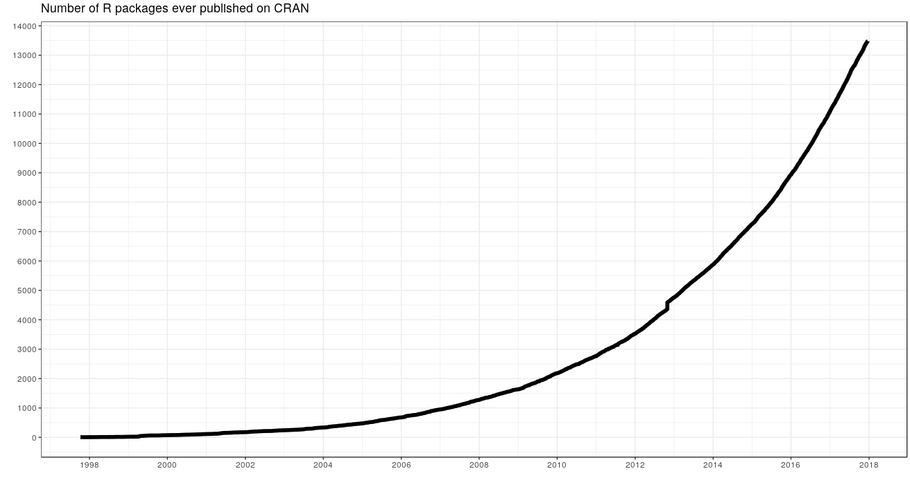

{width=1000}

### ¿Qué es R?

- Lenguaje para el procesamiento y análisis estadístico de datos
- Software Libre
- Sintaxis Básica: R base 
- Sintaxis incremental[^1]: El lenguaje se va ampliando por aportes de Universidades, investigadores/as, usuarios/as y empresas privadas, organizados en librerías (o paquetes)
- Comunidad web muy grande para realizar preguntas y despejar dudas. Por ejemplo, en el caso de Buenos Aires contamos con [R-Ladies Buenos Aires](https://www.meetup.com/es-ES/rladies-buenos-aires/) y [RenBaires](https://www.meetup.com/es-ES/renbaires/).
- Gráficos con calidad de publicación

[^1]: Más allá de los comandos elementales, comandos más sofisticados tienen muchas versiones, y algunas quedan en desuso en el tiempo.

{width=1000}


{width=1000}

Uno de los _entornos_ más cómodos para utilizar el _lenguaje_ __R__ es el _programa_ __R studio__.

- Rstudio es una empresa que produce productos asociados al lenguaje R, como el programa sobre el que corremos los comandos, y extensiones del lenguaje (librerías).
 
- El programa es _gratuito_ y se puede bajar de la 
[página oficial](https://www.rstudio.com/) 


{width=1000}


### Lógica sintáctica.

#### Definición de objetos
Los __Objetos/Elementos__ constituyen la categoría esencial del R. De hecho, todo en R es un objeto, y se almacena con un nombre específico que **no debe poseer espacios**. Un número, un vector, una función, la progresión de letras del abecedario, una base de datos, un gráfico, constituyen para R objetos de distinto tipo. Los objetos que vamos creando a medida que trabajamos pueden visualizarse en el panel derecho superior de la pantalla (el _Environment_). 

El operador __```<-```__ (__Alt + Guión__) sirve para definir un objeto.  __A la izquierda__ del __```<-```__ debe ubicarse el nombre que tomará el elemento a crear. __Del lado derecho__ debe ir la definición del mismo.


```{r}
A <- 1
```

Por ejemplo, podemos crear el elemento __A__, cuyo valor será 1. Para esto, debemos _correr_ el código presionando __Ctrl + Enter__, con el cursor ubicado en cualquier parte de la línea. Al definir un elemento, el mismo queda guardado en el ambiente del programa, y podrá ser utilizado posteriormente para observar su contenido o para realizar una operación con el mismo.

```{r}
A 
A+6
```

Al correr una linea con el nombre del objeto, la consola del programa nos muestra su contenido. Entre corchetes observamos el número de orden del elemento en cuestión. Si corremos una operación, la consola nos muestra el resultado de la misma.

El operador __```=```__ es __equivalente__ a __```<-```__, pero en la práctica no se utiliza para la definición de objetos.   

```{r}
B = 2
B
```

__```<-```__ es un operador __Unidireccional__, es decir que:     
```A <- B``` implica que __A__ va tomar como valor el contenido del objeto __B__, y no al revés.

```{r}
A <- B
A      # Ahora A toma el valor de B, y B continúa conservando el mismo valor
B
```


### R base

Con _R base_ nos referimos a los comandos básicos que vienen incorporados en el R, sin necesidad de cargar librerías. 

#### Operadores lógicos: 

- $>$ (mayor a-)
- $>=$ (mayor o igual a-)
- $<$ (menor a-)
- $<=$ (menor o igual a-)
- $==$ (igual a-)
- $!=$ (distinto a-)

```{r}
# Redefinimos los valores A y B
A <- 10
B <- 20

# Realizamos comparaciones lógicas
A >  B
A >= B
A <  B
A <= B
A == B
A != B

C <- A != B
C
```

Como muestra el último ejemplo, el resultado de una operación lógica puede almacenarse como el valor de un objeto.

#### Operadores aritméticos:

```{r}
#suma
A <- 5+6
A
#Resta
B <- 6-8
B
#cociente
C <- 6/2.5
C
#multiplicacion
D <- 6*2.5
D
```

#### Funciones:
Las funciones son series de procedimientos estandarizados, que toman como imput determinados argumentos a fijar por el usuario, y devuelven un resultado acorde a la aplicación de dichos procedimientos. Su lógica de funcionamiento es:   
```funcion(argumento1 = arg1, argumento2 = arg2)```      

A lo largo del curso iremos viendo numerosas funciones, según lo requieran los distintos ejercicios. Sin embargo, veamos ahora algunos ejemplos para comprender su funcionamiento:    

- paste() : concatena una serie de caracteres, pudiendo indicarse cómo separar a cada uno de ellos        
- paste0(): concatena una serie de caracteres sin separar
- sum(): suma de todos los elementos de un vector   
- mean() promedio aritmético de todos los elementos de un vector   

```{r}
paste("Pega", "estas", 4, "palabras", sep = " ")

#Puedo concatenar caracteres almacenados en objetos
paste(A, B, C, sep = "**")

# Paste0 pega los caracteres sin separador
paste0(A, B, C)

1:5

sum(1:5)

mean(1:5, na.rm = TRUE)
```


#### Caracteres especiales

- R es sensible a mayúsculas y minúsculas, tanto para los nombres de las variables, como para las funciones y parámetros.
- Los __espacios en blanco__ y los __carriage return__ (_enter_) no son considerados por el lenguaje. Los podemos aprovechar para emprolijar el código y que la lectura sea más simple[^2].

[^2]: veremos que existen ciertas excepciones con algunos paquetes más adelante. 

- El __numeral__ ```#``` se utiliza para hacer comentarios. Todo lo que se escribe después del # no es interpretado por R. Se debe utilizar un # por cada línea de código que se desea anular

- Los __corchetes__ ```[]``` se utilizan para acceder a un objeto:
    - en un vector[n° orden]
    - en una tabla[fila, columna]
    - en una lista[n° elemento]   
    
- el signo __$__ también es un método de acceso. Particularmente, en los dataframes, nos permitira acceder a una determinada columna de una tabla

- Los __paréntesis__```()``` se utilizan en las funciones para definir los parámetros.

- Las __comas__ ```, ```  se utilizan para separar los parametros al interior de una función. 

### Objetos:    
Existe una gran cantidad de objetos distintos en R, en lo que resepcta al curso trabajaremos principalmente con 3 de ellos:

- Valores
- Vectores
- Data Frames
- Listas

#### Valores
Los valores y vectores pueden ser a su vez de distintas _clases_:   

__Numeric__     

```{r}
A <-  1
class(A)
```


__Character__
```{r}
A <-  paste('Soy', 'una', 'concatenación', 'de', 'caracteres', sep = " ")
A
class(A)
```


__Factor__
```{r}
A <- factor("Soy un factor, con niveles fijos")
class(A)
```

La diferencia entre un _character_ y un _factor_ es que el último tiene solo algunos valores permitidos (levels), con un orden interno predefinido (el cual, por ejemplo, se respetará a la hora de realizar un gráfico)  


#### Vectores

Para crear un __vector__ utilizamos el comando ```c()```, de combinar.

```{r}
C <- c(1, 3, 4)
C
```

Podemos sumarle 2 a cada elemento del __vector__ anterior

```{r}
C <- C + 2
C
```

O sumarle 1 al primer elemento, 2 al segundo, y 3 al tercer elemento del __vector__ anterior
```{r}
D <- C + 1:3 # esto es equivalente a hacer 3+1, 5+2, 6+9 
D
```

```1:3``` significa que queremos todos los números enteros desde 1 hasta 3. 

Podemos crear un __vector__ que contenga las palabras: "Carlos", "Federico", "Pedro"
```{r}
E <- c("Carlos", "Federico", "Pedro")
E
```

Para acceder a algún elemento del vector, podemos buscarlo por su número de orden, entre ```[ ]```

```{r}
E[2]
```

Si nos interesa almacenar dicho valor, al buscarlo lo asignamos a un nuevo objeto, dándole el nombre que deseemos

```{r}
elemento2 <- E[2]
```

```{r}
elemento2
```

Para __borrar__ un objeto del ambiente de trabajo, utilizamos el comando _```rm()```_

```{r error=TRUE}
rm(elemento2)
elemento2
```

También podemos cambiar el texto del segundo elemento de E, por el texto "Pablo"

```{r}
E[2] <- "Pablo"
E
```

### Data Frames

Un Data Frame es una tabla de datos, donde cada columna representa una variable, y cada fila una observación.

Este objeto suele ser central en el proceso de trabajo, y suele ser la forma en que se cargan datos externos para trabajar en el ambiente de R, y en que se exportan los resultados de nuestros trabajo.  

También se puede crear como la combinación de N vectores de igual tamaño. Por ejemplo, tomamos algunos valores del [Indice de salarios](http://www.indec.gob.ar/bajarCuadroEstadistico.asp?idc=4020B33440609462654542BD0BC320F1523DA0DC52C396201DB4DD5861FFEDC9AD1436681AC84179)

```{r}
INDICE  <- c(100,   100,   100,
             101.8, 101.2, 100.73,
             102.9, 102.4, 103.2)

FECHA  <-  c("Oct-16", "Oct-16", "Oct-16",
             "Nov-16", "Nov-16", "Nov-16",
             "Dic-16", "Dic-16", "Dic-16")

GRUPO  <-  c("Privado_Registrado","Público","Privado_No_Registrado",
             "Privado_Registrado","Público","Privado_No_Registrado",
             "Privado_Registrado","Público","Privado_No_Registrado")

Datos <- data.frame(INDICE, FECHA, GRUPO)
Datos
```

Tal como en un __vector__ se ubica a los elementos mediante ```[ ]```, en un __dataframe__ se obtienen sus elementos de la forma __```[fila, columna]```__.

Otra opción es especificar la columna, mediante el operador __```$```__, y luego seleccionar dentro de esa columna el registro deseado mediante el número de orden.

```{r}
Datos$FECHA
Datos[3,2]
Datos$FECHA[3]
```

¿que pasa si hacemos ```Datos$FECHA[3,2]``` ?

```{r error=TRUE}
Datos$FECHA[3,2]
```

Nótese que el último comando tiene un número incorrecto de dimensiones, porque estamos refiriendonos 2 veces a la columna FECHA.    

Acorde a lo visto anteriormente, el acceso a los __dataframes__ mediante  ```[ ]``` puede utilizarse para realizar filtros sobre la base, especificando una condición para las filas. Por ejemplo, puedo utilizar los  ```[ ]``` para conservar del __dataframe__ ```Datos ```  unicamente los registros con fecha de Diciembre 2016:

```{r error=TRUE}
Datos[Datos$FECHA=="Dic-16",]
```

La lógica del paso anterior sería: Accedo al dataframe ```Datos```, pidiendo únicamente conservar las filas (por eso la condición se ubica a la _izquierda_ de la  ```, ```) que cumplan el requisito de pertenecer a la categoría __"Dic-16"__ de la variable __FECHA__.    

Aún más, podría aplicar el filtro y al mismo tiempo identificar una variable de interés para luego realizar un cálculo sobre aquella. Por ejemplo, podría calcular la media de los indices en el mes de Diciembre. 

```{r error=TRUE}
###Por separado
Indices_Dic <- Datos$INDICE[Datos$FECHA=="Dic-16"]
Indices_Dic
```

```{r error=TRUE}
mean(Indices_Dic)
```

```{r error=TRUE}
### Todo junto
mean(Datos$INDICE[Datos$FECHA=="Dic-16"])
```

La lógica de esta sintaxis sería: "Me quedo con la variable __INDICE__, cuando la variable FECHA sea igual a __"Dic-16"__, luego calculo la media de dichos valores".

### Listas

Contienen una concatenación de objetos de cualquier tipo. Así como un vector contiene valores, un dataframe contiene vectores, una lista puede contener dataframes, pero también vectores, o valores, y _todo ello a la vez_.

```{r}
superlista <- list(A,B,C,D,E,FECHA, DF = Datos, INDICE, GRUPO)
superlista
```

Para acceder un elemento de una lista, podemos utilizar el operador __```$```__, que se puede usar a su vez de forma iterativa. 

```{r}
superlista$DF$FECHA[2]
```

### Ambientes de trabajo

Hay algunas cosas que tenemos que tener en cuenta respecto del orden del ambiente en el que trabajamos:

- Working Directory: Es el directorio de trabajo. Pueden ver el suyo con `getwd()`, es *hacia donde apunta el código*, por ejemplo, si quieren leer un archivo, la ruta del archivo tiene que estar explicitada como el recorrido desde el Working Directory.
- Environment: Esto engloba tanto la información que tenemos cargada en *Data* y *Values*, como las librerías que tenemos cargadas mientras trabajamos. 

Es importante que mantengamos bien delimitadas estas cosas entre diferentes trabajos, sino:

1. El directorio queda referido a un lugar específico en nuestra computadora. 
  - Si se lo compartimos a otro **se rompe**
  - Si cambiamos de computadora **se rompe**
  - Si lo cambiamos de lugar **se rompe**
  - Si primero abrimos otro script **se rompe**
2. Tenemos mezclados resultados de diferentes trabajos:
  - Nunca sabemos si esa variable/tabla/lista se creo en ese script y no otro
  - Perdemos espacio de la memoria
  - No estamos seguros de que el script cargue todas las librerías que necesita

Rstudio tiene una herramienta muy útil de trabajo que son los **proyectos**. Estos permiten mantener un ambiente de trabajo delimitado por cada uno de nuestros trabajos. Es decir:

- El directorio de trabajo se refiere a donde esta ubicado el archivo .Rproj
- El Environment es específico de nuestro proyecto.

Un proyecto no es un sólo script, sino toda una carpeta de trabajo. 

{width=1000}

Para crearlo, vamos al logo de nuevo projecto (Arriba a la derecha de la panatalla), y elegimos la carpeta de trabajo. 


### Tipos de archivos de R

- __Script__: Es un archivo de texto plano, donde podemos poner el código que utilizamos para preservarlo
- __Rnotebook__: También sirve para guardar el código, pero a diferencia de los scripts, se puede compilar, e intercalar código con resultados (este archivo es un rnotebook)
- __Rproject__: Es un archivo que define la metadata del proyecto
- __RDS y Rdata__: Dos formatos de archivos propios de R para guardar datos. 
