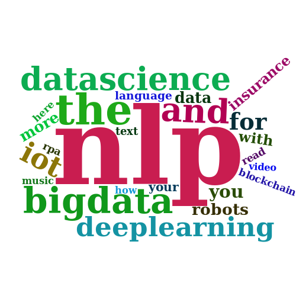
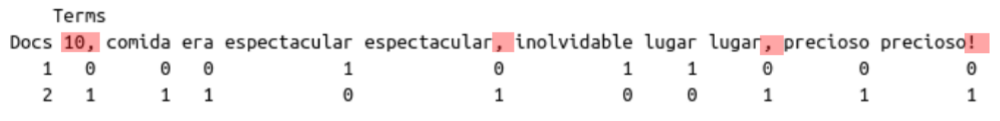
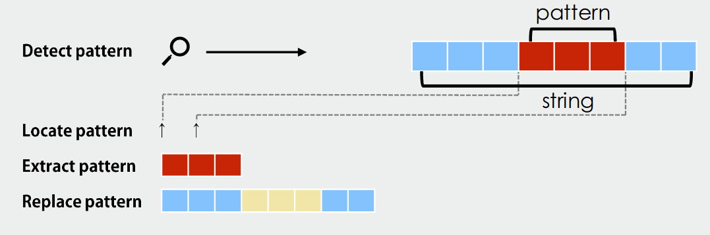
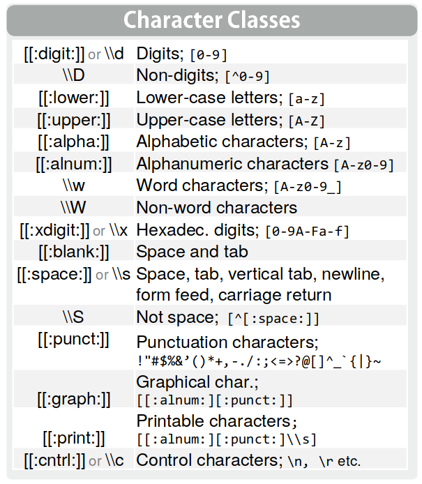
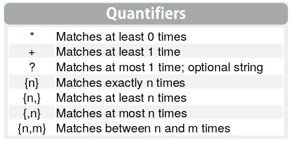
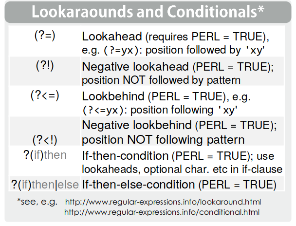
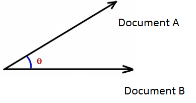
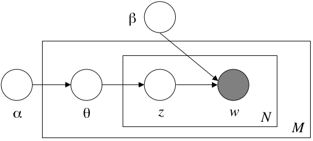
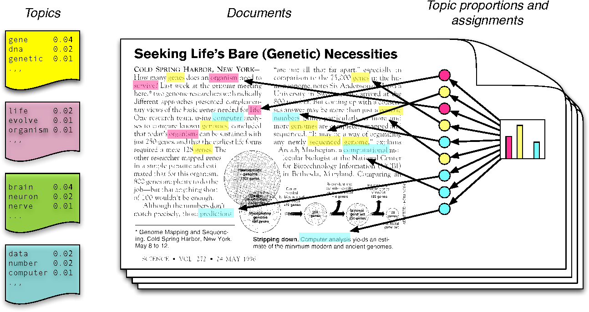

### Introducción

- Junto con las imágenes y los audios, los textos son una fuente de datos no estructurados que se multiplicó en los últimos años.

- Para poder hacer uso de la información que contienen es necesario procesar los documentos originales a un formato lo suficientemente estandarizado como para que pueda alimentar algún tipo de modelo

- En la clase de hoy veremos un repaso de algunas de las técnicas más usuales para normalizar la información de documentos.

### Bag of Words

- Los documentos se pueden caracterizar por las palabras que contienen. Esto esconde el supuesto fuerte de independencia. No estamos considerando el orden

- Para este tipo de técnicas, una buena representación de la información es una bolsa de palabras. Un formato que indica la cantidad de veces que aparece una palabra en un documento.

- También se conocen como Matrices Documento-Término o Término-Documento, según la orientación

__Ejemplo__: opiniones de trip advisor:


```{r}
library(tm)
doc1='Lugar espectacular e inolvidable'
doc2='Precioso lugar, la comida era espectacular, de 10, precioso!'

texto <- c(doc1,doc2)

myCorpus = VCorpus(VectorSource(texto))
myDTM = DocumentTermMatrix(myCorpus, control = list(minWordLength = 1))
m = as.matrix(myDTM)
m
```




- Nosotros sabemos que el significado de “lugar” y “lugar,” es el mismo

- Al no estar normalizada la información, la BoW genera matrices muy grandes y esparsas, que son poco útiles para trabajar


### Normalización


Para construir el Bag of Words se debe considerar los siguientes procesos:

- __Tokenization__: Es el proceso de partir un string de texto en palabras y signos de puntuación.
 
- __Eliminar puntuación__.

- __Stop Words__: remover las palabras más comunes del idioma (“el”, “la”, “los”, “de”) ya que aparecen en todos los documentos y no aportan información valiosa para distinguirlos.

- __Lemmatization__: Es la representación de todas las formas flexionadas (plural, femenino, conjugado, etc.). Para esto, es necesario contar con una base de datos léxica. Para esto podemos usar [koRpus](https://github.com/unDocUMeantIt/koRpus) que incluye el lexicón TreeTagger.

- __Stemming__: Es similar a la lematización, pero no se basa en las estructuras lexicales, sino que realiza una aproximación, quedándose con las primeras letras de la palabra. 

- _N-gramas_: A veces los conceptos que permiten distinguir entre documentos se componen de más de una palabra, por ejemplo:
  - “a duras penas” (trigrama),
  - “Buenos Aires” (bigrama) 

- Las expresiones idiomáticas o los nombres propios cambian radicalmente de sentido si se separan sus componentes. 
  - Imaginense si quisiéramos clasificar la posición política de izquierda a derecha de los “Nacional Socialistas”!

__Ejemplo__: Limpiando el texto:


```{r}

doc1='Lugar espectacular e inolvidable'
doc2='Precioso lugar, la comida era espectacular, de 10, precioso!'

texto <- c(doc1,doc2)

myCorpus = VCorpus(VectorSource(texto))
myCorpus = tm_map(myCorpus, content_transformer(tolower))
myCorpus = tm_map(myCorpus, removePunctuation)
myCorpus = tm_map(myCorpus, removeNumbers)
myCorpus = tm_map(myCorpus, removeWords, stopwords(kind = "es"))
myDTM = DocumentTermMatrix(myCorpus, control = list(minWordLength = 1))
m = as.matrix(myDTM)
m
```

### [Expresiones regulares.](https://stringr.tidyverse.org/articles/regular-expressions.html)

Un elemento fundamental para la manipulación del texto son las _expresiones regulares_. Éstas sirven para captar _patrones_ que aparecen en el texto y luego operar sobre ellos (extraerlos, reemplazarlos, detectarlos, etc.)

{width=1000}


por ejemplo

```{r}
un_texto <- 'una concatenación de caracteres'

str_detect(un_texto, 'una')
```


Para generar una expresión regular, utilizamos distintos elementos:

#### Caracteres especiales.


Son formas de referirnos a tipos de caracteres

{width=300}

por ejemplo

```{r}
str_detect(un_texto, '[[:punct:]]')
str_detect(un_texto, '[[:alnum:]]')

```

{width=300}

Los cuantificadores nos permiten decír "Este caracter, X veces"

por ejemplo
```{r}
nchar(un_texto)
str_detect(un_texto, '(\\w|\\W){29,33}')
str_detect(un_texto, '(\\w|\\W){32,35}')

```
Esto se lee como "caracteres de palabras (a,b,c...z ; A,B,C... Z ; 0,1,2..9) __ó__ otros caracteres distintos, entre 29 y 33 veces". 


A veces para extraer pedazos de texto nos conviene chequear que hay antes y después. Eso lo hacemos con los _lookarounds_

{width=300}

Por ejemplo, si queremos recuerar el DNI de la persona entre muchas otras palabras:

```{r}
texto_con_dni <- 'Lorem ipsum dolor sit amet, DNI 38765239,faucibus et dui tellus, eros mi elit...'

str_extract(texto_con_dni, pattern = '(?<=DNI )\\d{3,}')
```
el patrón se lee "Luego de _DNI _ tres o más dígitos"

### Distancia de palabras

La distancia de palabras se puede entender desde distintos lugares:


- __Distancia de caracteres__: Refiere a la similitud de escritura “Mueve” vs “Nueve”
- __Distancia conceptual__:  Refiere a la similitud del concepto: “Perro” vs “Labrador”


#### Distancia de caracteres

- __Distancia de Levenshtein__ o distancia de edición es el número mínimo de operaciones requeridas para transformar una cadena de caracteres en otra. Una operación puede ser una inserción, eliminación o sustitución de un carácter.

- __Jaro Winkler__: Esta medida de similitud da mejores puntajes a los strings que son similares en el principio de la oración. $0 < sim_{jw}<1$, donde 1 significa que las palabras son idénticas (excepto que p=0.25 y compartan los primeros 4 caracteres). y 0 significa que no se parecen en nada


#### Distancia Conceptual


-  __Word Embeddings__: Son una representación vectorial de las palabras que se construye a partir de observar una gran cantidad de documentos.

- __Word2Vec__ fue la primera implementación de esta idea. Se entrena una red neuronal para predecir el contexto de una palabra, y luego se utiliza una matriz que se construye dentro de la red como representación de las palabras.


__ejemplo__: [Word Embedding de textos marxistas](https://projector.tensorflow.org/?config=https%3A%2F%2Fraw.githubusercontent.com%2FDiegoKoz%2FMIA_text_mining%2Fmaster%2FWordVectors%2Ftensorboard_config.json)

### Distancia de Documentos

#### Similitud Coseno


- En el modelo de __BoW__ representamos a todos los documentos como vectores n-dimensionales que toman valores en el espacio de los números enteros. 

- La dimensión n del espacio está determinada por lo largo del vocabulario utilizado en el corpus. 

- Para comparar la similitud entre dos documentos, podemos utilizar la __similitud coseno__ entre sus representaciones vectoriales.  Intuitivamente, la similitud coseno es una medida de correlación de vectores que representan atributos en lugar de variables que se mueven en un espacio continuo. 


recordemos primero algunas definiciones. 


El producto interno entre dos vectores x,y se define como:


$$
\langle x,y \rangle=\sum_i x_i y_i = \|x\|\ \|y\|\cos(\theta)
$$


Por su parte, la norma 2 de un vector x se define como:

$$
||x||=\sqrt{\sum_i x^2_i}
$$



$$
CosSim(x,y) = \frac{\langle x,y \rangle}{\|x\|\ \|y\|} = \frac{\sum_i x_iy_i}{\sum_i x^2_i\sum_i y^2_i} 
$$


- Cuantas más palabras compartan los documentos, mayor es el producto punto. Este a su vez se normaliza por el tamaño de cada documento. 

- Este valor va de 1 para los documentos son identicos a 0 cuando son totalmente distintos.


### Topic Modelling

- Las técincas de Modelado de Tópicos tratan de captar los temas de los que habla un corpus de texto.

- Una de las técnicas más difundidas en la actualidad es [__Latent Dirichlet Allocation Models__](http://www.jmlr.org/papers/volume3/blei03a/blei03a.pdf)
- Éste es un modelo inferencial bayesiano. No vamos a poder estdiar el detalle del modelo en este curso, pero a grandes rasgos propone un _proceso generativo_ donde cada palabra es el resultado de un encadenamiento de distribuciones, y luego se realiza _inferencia hacia atrás_ para calcular _la distribución más probable dada las palabras y los documentos_

{width=1000}

El resultado del modelo es:

- _Una distribución de palabras por tópico_: Podemos caracterizar cada tópico por sus palabras más importantes.
- _Una distribución de los tópicos por documento_: Podemos caracterizar un documento por sus temas más importantes


{width=1000}

