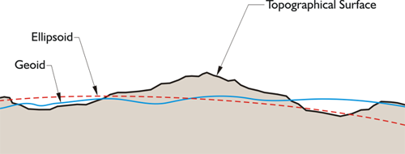
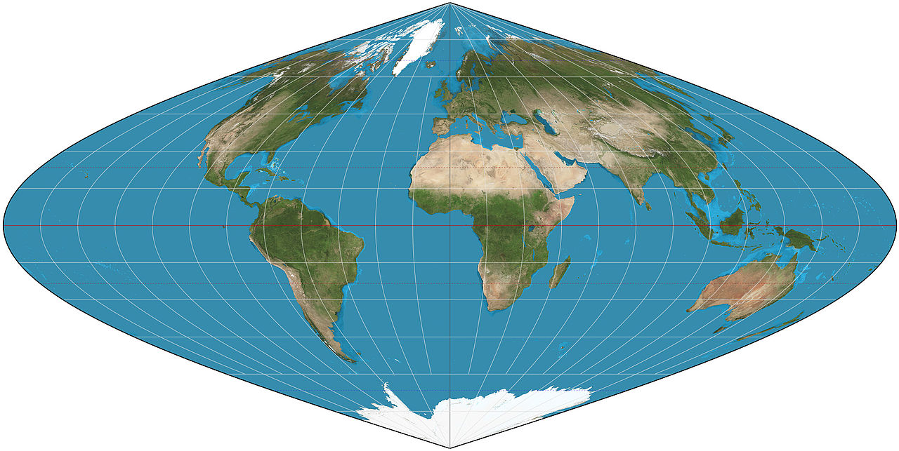
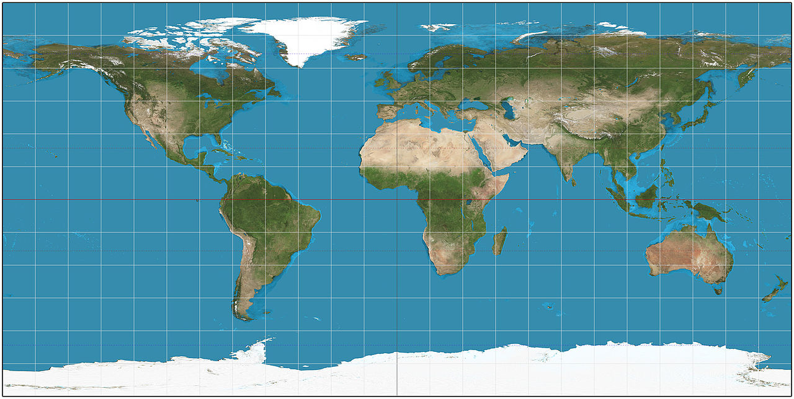
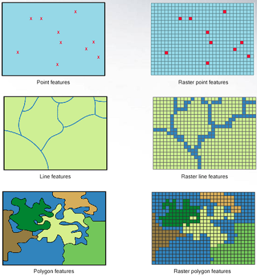
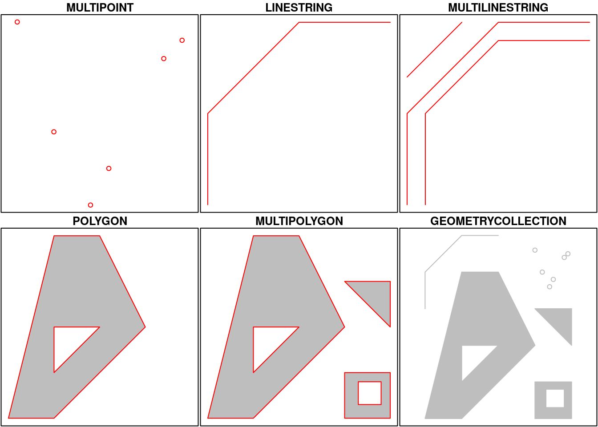

Hay varios paquetes en R con funciones que permiten manipular información espacial con facilidad. El objetivo de esta clase es introducir algunos de ellos a fin de combinarlos con algunas de las herramientas que ya vimos, para hacer análisis geográfico y crear nuestros propios mapas.  

Las presentes notas están basadas en: 

- [sf vignettes](https://cran.r-project.org/web/packages/sf/vignettes/sf1.html)
- [libro _Ciencia de datos para gente sociable_, de Antonio Vazquez Brust](https://bitsandbricks.github.io/ciencia_de_datos_gente_sociable/informacion-geografica-y-mapas.html)

### Datos georreferenciados

Sería ideal contar con un cuerpo que consista en una representación de la tierra en escala a la hora de trabajar con datos geográficos. Sin embargo, esto no sería práctico, por lo que normalmente trabajamos con representaciones en 2 dimensiones, como son los mapas.  

Para construir un mapa, primero necesitamos un modelo abstracto en 3 dimensiones del planeta:

- esfera
- elipsoide
- geoide (una forma teórica de la Tierra determinada por la geodesia en la cual se toma como superficie teórica el nivel medio de los mares)

{width=500}


### Proyecciones y distorsiones

- Mercator: preserva ángulos
- Sinusoidal: preserva áreas, pero distorsiona formas y direcciones
- Equidistante cilíndrica: preserva distancias entre meridianos

{width=250} {width=250} {width=250}

### Tipos de datos espaciales

- Vectoriales: puntos, líneas, polígonos
- Rasters: pixels, grillas

{width=500}

Palabras clave para consultas sobre datos espaciales:

- Distancia
- Largo
- Area
- Centroide
- Igual
- Disjunto
- Intersecta
- Toca
- Cruza
- Superpone
- Contiene
- Buffering

### Paquete sf

El paquete sf permite combinar datos de tipo vectorial y atributos asociados a dicho espacio.   

La implementación de los puntos, líneas y polígonos en este paquete se extienden para incorporar multipuntos, multilíneas, multipolígonos, etc.

{width=500}


Los datos geográficos siempre van a estar en el objeto llamado `geometry`.


- bounding box:

```{r message=FALSE, warning=FALSE, include=FALSE}
library(tidyverse)
library(ggthemes)
library(sf)

radios <- st_read("../fuentes/CABA_rc.geojson")
```

```{r echo=FALSE, message=FALSE, warning=FALSE}
bbox <- st_bbox(radios %>% filter(BARRIO == "RETIRO"))

ggplot(data = radios %>% filter(BARRIO == "RETIRO"))+
  geom_sf(aes(fill=RADIO_ID))+
  geom_rect(xmin=bbox$xmin , xmax=bbox$xmax, ymin=bbox$ymin, ymax=bbox$ymax, color="red", fill="transparent")+
  theme_void()+
  theme(legend.position = 'none')
```

- EPSG (SRID): el sistema de coordenadas

Sistemas de coordenadas de referencia y proyecciones cartográficas:
Sistema de números que definen ubicaciones sobre la superficie de la Tierra; funcionan como direcciones. El tipo más conocido es el que usa latitud y longitud. Existen muchísimas proyecciones distintas, cada una pensada para minimizar alguno de los tipos de distorsión.

### Tipos de archivo

- shapefiles: guarda la información en varios archivos distintos, que suelen ser combinados en un archivo .zip. Los nombres de las variables en un shapefile deben tener 10 caracteres o menos. Fue inventado por la empresa ESRI (los creadores del software ArcGIS), y a pesar de las incomodidades mencionadas es muy común.

- GeoJSON: Es una alternativa más moderna; un estándar abierto que corrige los dos inconvenientes mencionados antes. Para nuestros ejercicios usaremos datos geográficos en este último formato.

- dataframes con columnas lat-long: Los datos también pueden ser presentados en un dataframe común, con una variable referida a la latitud y otra a la longitud. Podemos utilizar la función `st_as_sf` para realizar una conversión a tipo sf, y `st_set_crs` para indicar el sistema de coordenadas de referencia. Por ejemplo:

``` r
base <- st_as_sf(base, coords = c('long','lat'))%>% 
  st_set_crs(4326)
```


