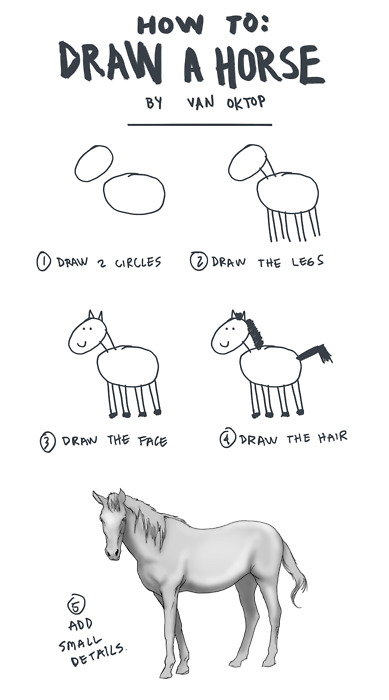

Nuestro compañero de trabajo, _Estatikoz_,realizó el siguiente código para visualizar la información de `gapminder`. 

- Si bien la idea del gráfico es interesante, el objetivo de _Estatikoz_ no era ver sólo la información del año 2000
- Tampóco le interesa sólo la información de Europa
- Por último, en gapminder también hay información sobre la esperanza de vida (`lifeExp`) que es relevante en el análisis. 


```{r message=FALSE, warning=FALSE}
library(tidyverse)
library(treemapify)
library(gapminder)
library(viridis)

gapminder <- gapminder_unfiltered

gapminder %>% 
  filter(year==2000, continent=='Europe') %>%
  ggplot(., aes(area = pop, fill = gdpPercap, label = country)) +
  geom_treemap() +
  geom_treemap_text(fontface = "italic", colour = "white", place = "centre",
                    grow = TRUE)+
  scale_fill_viridis(option = 'C')+
  labs(title = 'Treemap Europe', subtitle = 'Año 2000',caption = 'Tamaño según población.')

```


__El objetivo es transformar este código en una visualización Shiny que incorpore todos los elementos que faltan.__


> Hagamos una guía paso a paso 

{width=300}


1. Pensamos qué queremos mostrar `r emo::ji("check")`
2. Escribimos código _estático_ para un caso particular.`r emo::ji("check")`
3. Pensamos qué partes queremos generalizar.`r emo::ji("check")`

4. Armamos una función que tome como parámetros aquello que generalizamos

```{r}
grafico_treemap <- function(){
  
}
```


5. Armamos un shiny estático que nos muestre el resultado de la función con parámetros fijos

```{r}
# El shiny mejor hacerlo en un archivo separado, que se llame app.r
```

6. Agregamos los inputs en el ui
7. reemplazamos los parámetros fijos por los de input en el server
8. Agregamos texto y otros elementos 'cosméticos'


- hint: A veces esta bueno pegar las cosas con $glue$
- hint: Qué pasa con el ancho y largo del gráfico? lo podemos mejorar?
- hint: Que tipo de _widget_ nos conviene usar para el input de años? podemos mirar las opciones acá: [inputs](https://shiny.rstudio.com/tutorial/written-tutorial/lesson3/)

