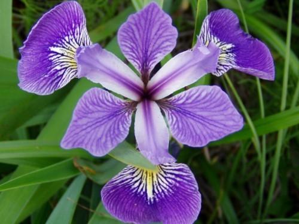
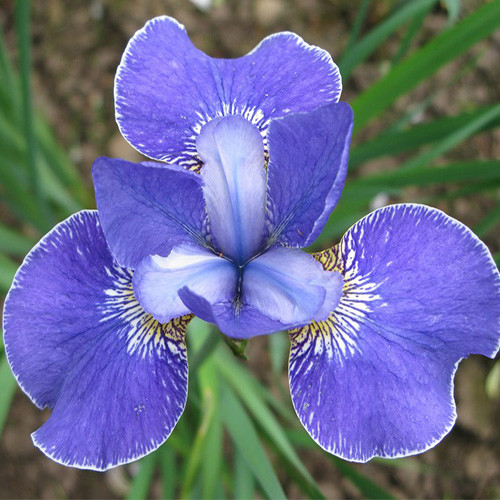

Vamos a Trabajar con el dataset de iris, y en particular con las especies versicolor y setosa

### Consignas:

1. Realizar estadísticas descriptivas para cada grupo para las variables `Petal.Length` y `Petal.Width` :
 + Media
 + Desvío estándar
 + Cuartiles
 
2. Graficar el histograma y el boxplot de `Petal.Length` y `Petal.Width` para ambos grupos.

3. Cual de estas poblaciones tiene en promedio el Pétalo más ancho? plantee las hipótesis de un test de diferenicas de medias.

4. Calcule el test, asumiendo que el desvío estandar en ambas poblaciones es igual
5. Calcule el test, asumiendo que el desvío estandar en ambas poblaciones es diferente
6. Es significativa la diferencia

