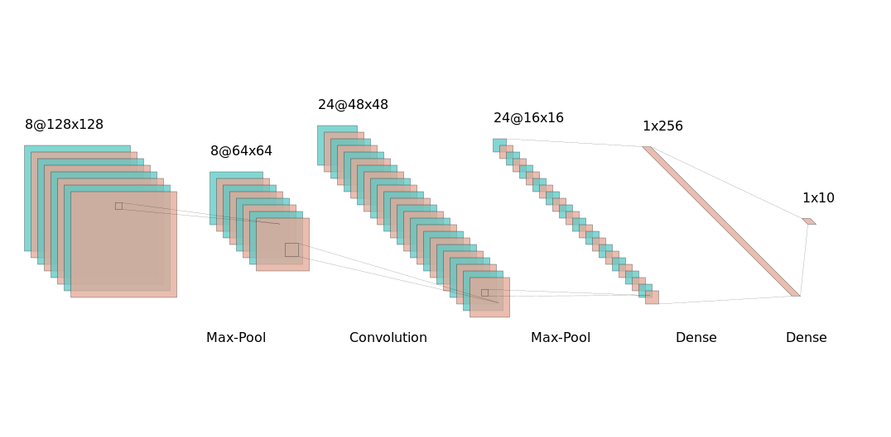
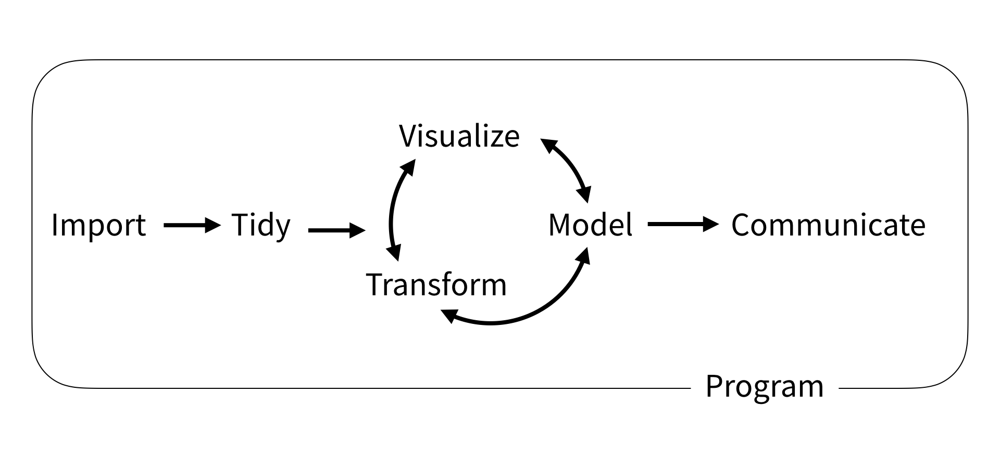
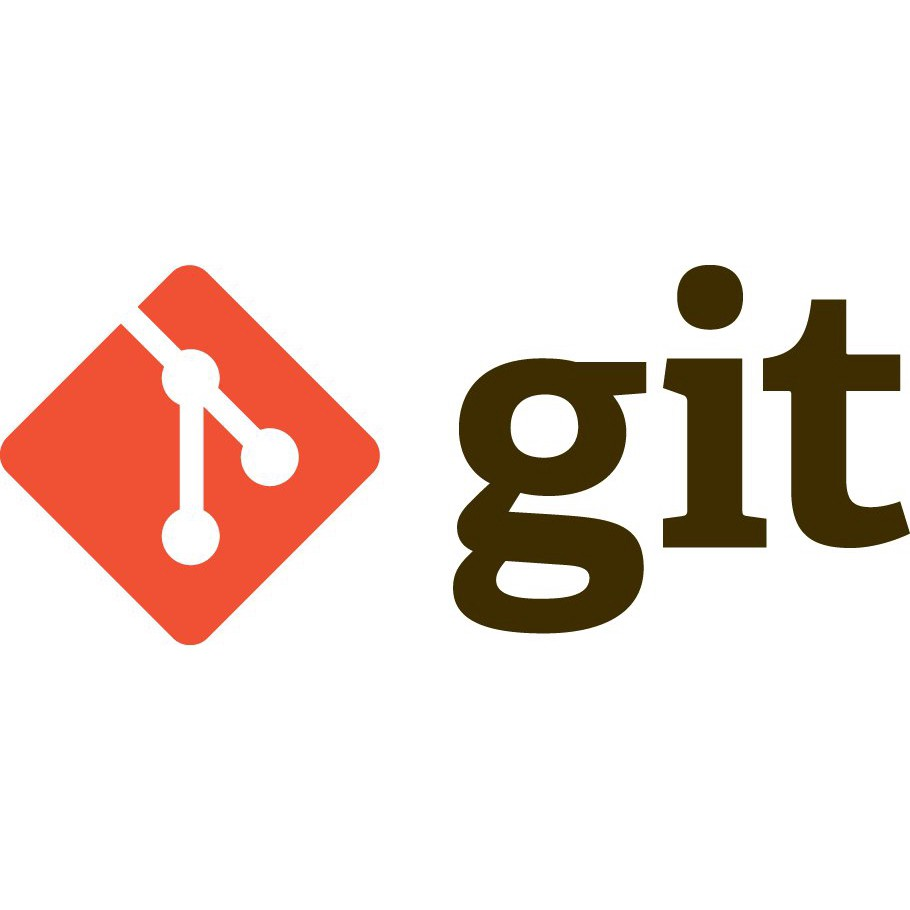

{width=1000}

## Técnicas

### Desde el punto de vista del tipo de aprendizaje:

- Aprendizaje Supervisado:
  - Desde estadística:
    - [Modelo Lineal](http://faculty.marshall.usc.edu/gareth-james/ISL/ISLR%20Seventh%20Printing.pdf)
    - [Ridge, Lasso, Elastic Net, Splines, etc.](http://faculty.marshall.usc.edu/gareth-james/ISL/ISLR%20Seventh%20Printing.pdf)
    - [Regresión logísitca](http://faculty.marshall.usc.edu/gareth-james/ISL/ISLR%20Seventh%20Printing.pdf)
    - [Support Vector Machine](http://faculty.marshall.usc.edu/gareth-james/ISL/ISLR%20Seventh%20Printing.pdf)
    - [Naive Bayes](http://profsite.um.ac.ir/~monsefi/machine-learning/pdf/Machine-Learning-Tom-Mitchell.pdf)
    - [Markov chains](https://web.stanford.edu/~hastie/Papers/ESLII.pdf)
    - ...
  - Desde computación:
    - [Sistema experto](http://profsite.um.ac.ir/~monsefi/machine-learning/pdf/Machine-Learning-Tom-Mitchell.pdf)
    - [K nearest neighbors](http://profsite.um.ac.ir/~monsefi/machine-learning/pdf/Machine-Learning-Tom-Mitchell.pdf)
    - [Árboles de decisión](http://profsite.um.ac.ir/~monsefi/machine-learning/pdf/Machine-Learning-Tom-Mitchell.pdf)
    - [Ensambles de árboles](https://doc.lagout.org/Others/Data%20Mining/Ensemble%20Methods%20in%20Data%20Mining_%20Improving%20Accuracy%20through%20Combining%20Predictions%20%5BSeni%20%26%20Elder%202010-02-24%5D.pdf)
      - [Random Forest (Bagging)](https://bookdown.org/content/2031/ensambladores-random-forest-parte-i.html#random-forest)
      - [XG-BOOST (Boosting)](https://machinelearningmastery.com/gentle-introduction-xgboost-applied-machine-learning/)
    - ...
  - Deep Learning:
    - [Multi-layer perceptron network](https://www.deeplearningbook.org/contents/mlp.html)
    - [Convolutional Neural Network](http://cs231n.github.io/convolutional-networks/)
    - [Long-short Term Memory Neural Network](https://www.deeplearningbook.org/contents/rnn.html)
    - ...
    
  {width=500}
  {width=1000}

- Aprendizaje No supervisado:

  - Clustering:
    - [K-means](http://faculty.marshall.usc.edu/gareth-james/ISL/ISLR%20Seventh%20Printing.pdf)
    - [Patition around medioids](https://www.cs.umb.edu/cs738/pam1.pdf)
    - [DBSCAN](https://elvex.ugr.es/idbis/dm/slides/43%20Clustering%20-%20Density.pdf)
    
  - Reducción de dimensionalidad:
    - [PCA](http://www.ub.edu/stat/personal/cuadras/metodos.pdf)
    - [LSI](http://lsa.colorado.edu/papers/dp1.LSAintro.pdf)
    - [LDA](http://www.jmlr.org/papers/volume3/blei03a/blei03a.pdf)
    - [T-SNE](https://lvdmaaten.github.io/tsne/)

- [Aprendizaje Semi-supervisado](https://www.geeksforgeeks.org/ml-semi-supervised-learning/)
- [Modelos generativos](https://www.oreilly.com/library/view/generative-deep-learning/9781492041931/ch01.html)

### Desde el punto de vista del tipo de datos:

- Datos estructurados:
  - Datos tabulados
  - Series de Tiempo:
    - [ARIMA](https://otexts.com/fpp2/arima.html)
    - [Wavelets](http://sedici.unlp.edu.ar/bitstream/handle/10915/24289/Documento_completo.pdf?sequence=1)
  - Grafos:
  - Datos geográficos
- Datos no estructurados:
  - texto:
    - [LDA](http://www.jmlr.org/papers/volume3/blei03a/blei03a.pdf)
    - [Word Embeddings](https://medium.com/@gruizdevilla/introducci%C3%B3n-a-word2vec-skip-gram-model-4800f72c871f)
  - imagenes
  - sonidos

### Desde el punto de vista del remuestreo:

- Test-train
- Cross-Validation
- [Bootstraping](https://machinelearningmastery.com/a-gentle-introduction-to-the-bootstrap-method/)

### Desde el punto de vista de la optimización:
- [Gradient Descent](https://hackernoon.com/gradient-descent-aynk-7cbe95a778da)
- [Algorítmos Genéticos](https://towardsdatascience.com/introduction-to-genetic-algorithms-including-example-code-e396e98d8bf3)
- [Inferencia Variacional](https://arxiv.org/pdf/1601.00670.pdf)

## Flujo de trabajo

[{width=1000}](https://r4ds.had.co.nz/introduction.html)

1. Preprocesamiento
1. Entrenamiento
1. Validación

## Meta flujo de trabajo

{width=200}
{width=1000}

Ejemplo: [https://github.com/DiegoKoz/intro_ds](https://github.com/DiegoKoz/intro_ds)

## Otros temas

- [Sobreajuste](https://diegokoz.shinyapps.io/overfitting/)
- [Trade-off sesgo varianza](http://faculty.marshall.usc.edu/gareth-james/ISL/ISLR%20Seventh%20Printing.pdf)
- Trade-off Precision-recall

{width=500}

## Implementaciones:

- [Caret](http://topepo.github.io/caret/index.html)
- [Tidymodels](https://rviews.rstudio.com/2019/06/19/a-gentle-intro-to-tidymodels/)
- [Sci-kit learn](https://scikit-learn.org/stable/)

