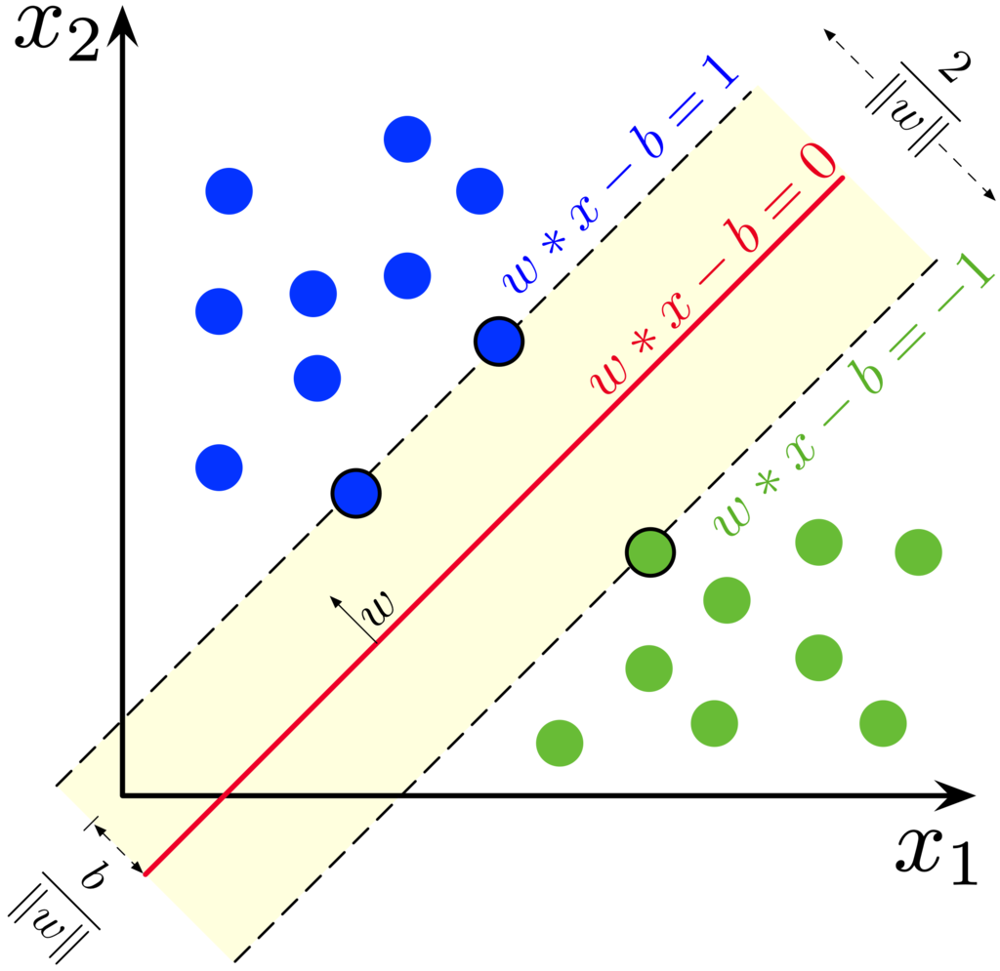
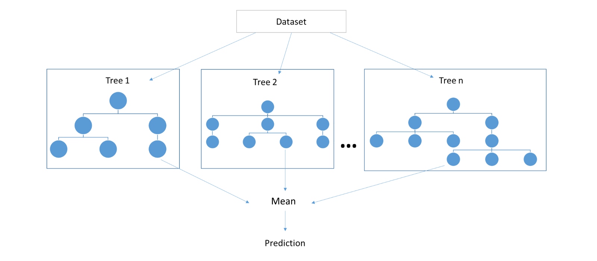
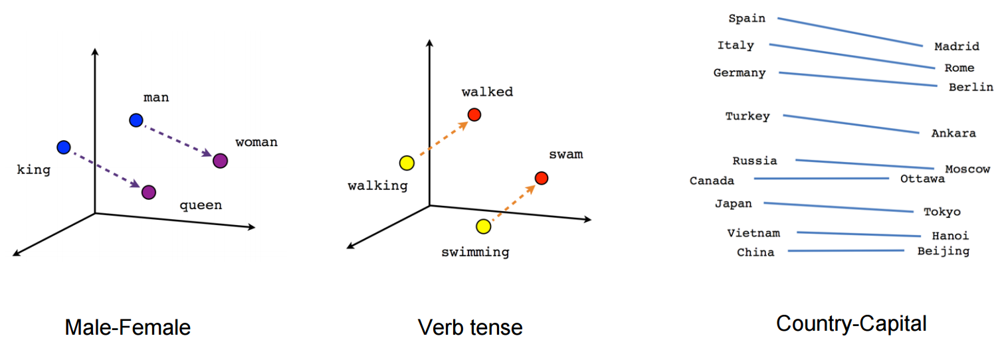

```{r message=FALSE, warning=FALSE}
library(tidyverse)
library(datasets)
library(titanic)

```


{width=750}

## Técnicas


### Desde el punto de vista del tipo de aprendizaje:

#### Aprendizaje Supervisado:
##### Desde estadística:

- [Modelo Lineal](http://faculty.marshall.usc.edu/gareth-james/ISL/ISLR%20Seventh%20Printing.pdf)
    

```{r}
datasets::attitude
ggplot(attitude, aes(rating, complaints))+
  geom_point()+
  geom_smooth(method = 'lm')
```
    
- [Ridge, Lasso, Elastic Net, Splines, etc.](http://faculty.marshall.usc.edu/gareth-james/ISL/ISLR%20Seventh%20Printing.pdf)
    
{width=500}
  
- [Regresión logísitca](http://faculty.marshall.usc.edu/gareth-james/ISL/ISLR%20Seventh%20Printing.pdf)
  
```{r}
set.seed(123)
df <- tibble(x = c(rchisq(20, 2),rchisq(20, 10)), y = rep(c(0,1), each=20))

ggplot(df, aes(x, y))+
  geom_point()+
  geom_smooth(method = "glm", 
    method.args = list(family = "binomial"), 
    se = FALSE)
```

- [Support Vector Machine](http://faculty.marshall.usc.edu/gareth-james/ISL/ISLR%20Seventh%20Printing.pdf)
{width=500}

- [Naive Bayes](http://profsite.um.ac.ir/~monsefi/machine-learning/pdf/Machine-Learning-Tom-Mitchell.pdf)
  
{width=500}
{width=750}
  
- [Markov chains](https://web.stanford.edu/~hastie/Papers/ESLII.pdf){width=500}
- ...
##### Desde computación:

- [Sistema experto](http://profsite.um.ac.ir/~monsefi/machine-learning/pdf/Machine-Learning-Tom-Mitchell.pdf)
- [K nearest neighbors](http://profsite.um.ac.ir/~monsefi/machine-learning/pdf/Machine-Learning-Tom-Mitchell.pdf)

- [Árboles de decisión](http://profsite.um.ac.ir/~monsefi/machine-learning/pdf/Machine-Learning-Tom-Mitchell.pdf)

{width=750}    

- [Ensambles de árboles](https://doc.lagout.org/Others/Data%20Mining/Ensemble%20Methods%20in%20Data%20Mining_%20Improving%20Accuracy%20through%20Combining%20Predictions%20%5BSeni%20%26%20Elder%202010-02-24%5D.pdf)
- [Random Forest (Bagging)](https://bookdown.org/content/2031/ensambladores-random-forest-parte-i.html#random-forest)
{width=750}    
- [XG-BOOST (Boosting)](https://machinelearningmastery.com/gentle-introduction-xgboost-applied-machine-learning/)
    
{width=750}    

- Y muchos más...

##### Deep Learning:

- [Multi-layer perceptron network](https://www.deeplearningbook.org/contents/mlp.html)
{width=500}
- [Convolutional Neural Network](http://cs231n.github.io/convolutional-networks/)
{width=1000}
- [Long-short Term Memory Neural Network](https://www.deeplearningbook.org/contents/rnn.html)
- ...
    

#### Aprendizaje No supervisado:

##### Clustering:

- [K-means](http://faculty.marshall.usc.edu/gareth-james/ISL/ISLR%20Seventh%20Printing.pdf)
- [Patition around medioids](https://www.cs.umb.edu/cs738/pam1.pdf)
- [DBSCAN](https://elvex.ugr.es/idbis/dm/slides/43%20Clustering%20-%20Density.pdf)

{width=500}
    
##### Reducción de dimensionalidad:
- [PCA](http://www.ub.edu/stat/personal/cuadras/metodos.pdf)
{width=500}
- [LSI](http://lsa.colorado.edu/papers/dp1.LSAintro.pdf)
- [T-SNE](https://lvdmaaten.github.io/tsne/)
{width=500}


#### [Aprendizaje Semi-supervisado](https://www.geeksforgeeks.org/ml-semi-supervised-learning/)

{width=500}

#### [Modelos generativos](https://www.oreilly.com/library/view/generative-deep-learning/9781492041931/ch01.html)

Por ejemplo: [https://transformer.huggingface.co/doc/gpt2-large](https://transformer.huggingface.co/doc/gpt2-large)

### Desde el punto de vista del tipo de datos:

#### Datos estructurados:
##### Datos tabulados
```{r}
iris
```

##### Series de Tiempo:

{width=750}

- [ARIMA](https://otexts.com/fpp2/arima.html)
- [Wavelets](http://sedici.unlp.edu.ar/bitstream/handle/10915/24289/Documento_completo.pdf?sequence=1)

{width=500}

##### Grafos:

{width=500}

##### Datos geográficos

{width=500}

#### Datos no estructurados:
##### texto:

- [LDA](http://www.jmlr.org/papers/volume3/blei03a/blei03a.pdf)

{width=500}

- [Word Embeddings](https://medium.com/@gruizdevilla/introducci%C3%B3n-a-word2vec-skip-gram-model-4800f72c871f)

{width=500}

##### imagenes
##### sonido


### Desde el punto de vista del remuestreo:

- Test-train
- Cross-Validation

{width=500}


- [Bootstraping](https://machinelearningmastery.com/a-gentle-introduction-to-the-bootstrap-method/)

{width=500}


### Desde el punto de vista de la optimización:
- [Gradient Descent](https://hackernoon.com/gradient-descent-aynk-7cbe95a778da)

{width=500}


- [Algorítmos Genéticos](https://towardsdatascience.com/introduction-to-genetic-algorithms-including-example-code-e396e98d8bf3)

{width=500}

- [Inferencia Variacional](https://arxiv.org/pdf/1601.00670.pdf)


## Flujo de trabajo

[{width=1000}](https://r4ds.had.co.nz/introduction.html)

1. Preprocesamiento
1. Entrenamiento
1. Validación

## Meta flujo de trabajo

{width=200}
{width=1000}

Ejemplo: [https://github.com/DiegoKoz/intro_ds](https://github.com/DiegoKoz/intro_ds)

## Otros temas

- [Sobreajuste](https://diegokoz.shinyapps.io/overfitting/)

{width=750}


- [Trade-off sesgo varianza](http://faculty.marshall.usc.edu/gareth-james/ISL/ISLR%20Seventh%20Printing.pdf)

{width=500}

- Trade-off Precision-recall

{width=500}

## Implementaciones:

- [Caret](http://topepo.github.io/caret/index.html)
- [Tidymodels](https://rviews.rstudio.com/2019/06/19/a-gentle-intro-to-tidymodels/)
- [Sci-kit learn](https://scikit-learn.org/stable/)


