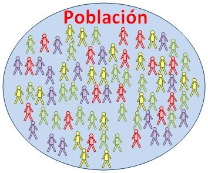
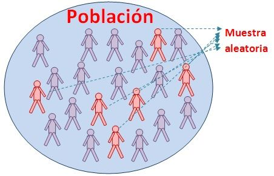
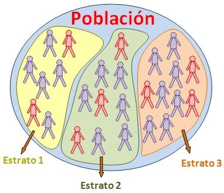
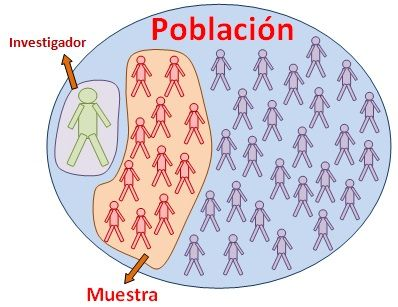
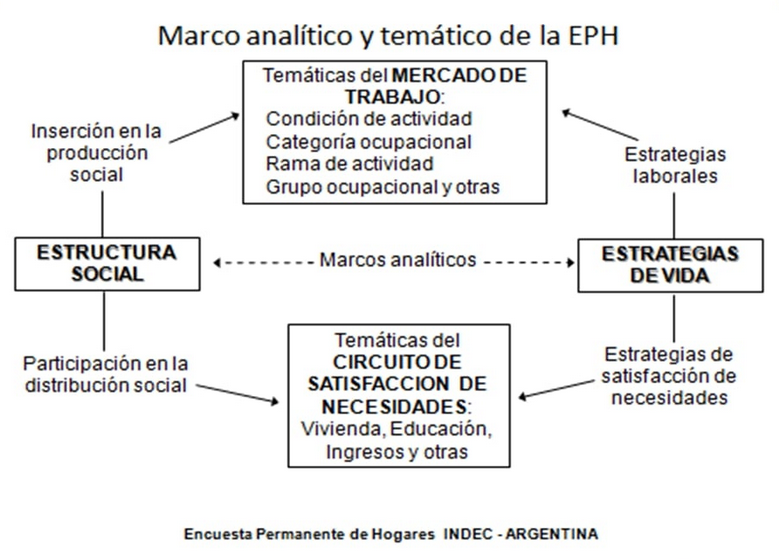

En esta clase veremos distintos aspectos a tener en cuenta a la hora de trabajar con encuestas, ya sea porque necesitemos diseñar e implementar una, o porque se requiera trabajar con los datos de una encuesta ya realizada y publicada. 

### Población y muestra

__Población__: El universo en estudio ( __N__ ).  

Sobre esos elementos se observan variables, que son características que cambian de individuo a individuo.

{width=300}

* La población se define en relación al problema de investigación a abordar.

* Puede ser una población finita:
  + Los votantes en una elección.
  + Asalariados de CABA.
  
* O bien infinita:
  + El lanzamiento de una moneda
  + El lanzamiento de un dado

* En otros casos el límite es difuso:
  + Si la población cambia en el tiempo, ¿los votantes en los meses previos a una elección son finitos o infinitos?

__Muestra__: Subconjunto de __n__ observaciones de una población.   

* Son los elementos de la población que podemos __medir__, para __realizar inferencia respecto a la población__

### Tipos de muestra

__Probabilísticas__: La __selección aleatoria__ de la muestra nos garantiza independencia en las observaciones, lo que nos permite saber cuántas observaciones necesito para obtener un cierto margen de error.

* Muestreo aleatorio simple

Todos los individuos tienen la misma probabilidad de ser elegidos. 

{width=300}

* Muestreo aleatorio estratificado

Los individuos se dividen en grupos o estratos. La muestra se elige escogiendo en cada estrato individuos elegidos por muestro aleatorio simple.

{width=300}

__No probabilísticas__: No surge de un proceso de selección aleatoria. Los sujetos en una muestra no probabilística generalmente son seleccionados en función de su accesibilidad o a criterio personal del investigador.

* Los eventos no son independientes
* No se puede extrapolar de la muestra a la población
* Sirve para captar atributos de un subconjunto de la población

{width=300}

### El cuestionario

__Cuestionario__: Es el instrumento con el que vamos a recolectar los datos. Ahí se encuentran las preguntas y también algunas aclaraciones que puede venir bien tener a mano.   

Diversas cuestiones a tener en cuenta:

* El propósito del cuestionario, hay que tener bien claros los objetivos principales
* El período de referencia
* Completitud del universo de estudio (¿Toda la población se puede clasificar en las respuestas o queda alguien afuera?)
* El flujo del cuestionario, pensar si hay subpoblaciones a las que ciertas preguntas no aplican, dado lo que ya respondieron anteriormente
* Las instrucciones deben ser claras y completas, los términos importantes tienen que estar bien definidos para encuestador y/o para el encuestado
* Establecer la mejor secuencia de aspectos o temas
* El cuestionario no tiene que ser innecesariamente largo (Problema de no-respuesta)
* No conviene empezar con preguntas difíciles/muy directas/que puedan incomodar 
* Las preguntas no deben sugerir/inducir hacia lo que se desea como respuesta

Para cada pregunta, preguntémonos:

* ¿Es demasiado general? ¿Es demasiado detallada?
* ¿Las palabras utilizadas son sencillas? ¿La estructura es breve y clara?
* ¿Sería más práctico subdividir la pregunta en otras más específicas? (y a la inversa)
* ¿Se refiere a una cuestión sobre la cual todos los encuestados deberian tener información para responder?
* ¿Es posible contestar la pregunta sin cometer un error? O, ¿Qué grado de error se puede tener?
* ¿Es necesario o sería útil complementar la pregunta con algún ejemplo? ¿Y con alguna ilustración?
* ¿La pregunta puede llegar a incomodar?
* ¿Conviene que sea una pregunta abierta o con categorías?
* ¿Puede la pregunta ser interpretada por diferentes personas de diferente manera? (Ej: Jefatura de hogar)

> Probar el cuestionario!!

### Sesgos

Tenemos un problema de __sesgo__ cuando hay un peso desproporcionado a favor o en contra de una cosa, persona o grupo en comparación con otra, generalmente de una manera que se considera injusta. Es la diferencia entre lo que estimamos y lo que queríamos estimar.   

¿De dónde puede salir ese sesgo?      

* De la __Muestra__: tomamos una muestra que pensábamos que representaba a la población que queríamos estudiar pero resulta que hay factores que no tuvimos en cuenta. Por ejemplo: Hacer una encuesta sobre condiciones de vida por twitter, hacer una encuesta sobre uso de tecnologías en la puerta de un Shopping, etc.     

* De la __recolección de datos__. Si en vez de tener una muestra clara, le pedimos al encuestador que elija gente "aleatoriamente" en una esquina, puede haber sesgos debidos a sus prejuicios, la verguenza para hablar con cierto tipo de gente, etc. Si le pedimos a la policía que elija gente para pedir DNIs al azar puede haber sesgos (el famoso "portación de cara").

* De la __limpieza y análisis de los datos__: Si a la hora de emprolijar los datos que obtuvimos, nos preocupamos más por aquellas observaciones que tienen cierta característica en particular, podemos sesgar los indicadores que calculemos luego. Por ejemplo: Si en una encuesta de ingresos reviso sólo los montos que me parecen muy bajos, pero no los que me parecen muy altos.    

Al respecto, podemos pensar en: 

* La formas en que se pregunta: tanto en el cuestionario como en los encuestadores, que todo sea lo más homogéneo posible, así la calidad de los datos no dependen del encuestador que tocó en cada caso.
* Sensibilización/perfiles del encuestador
  + Ej: Sexo en censo (no es por observación)

### No respuesta

En las encuestas suele ocurrir que sea imposible obtener una respuesta por parte de algunos encuestados para una, más de una, o todas las variables que se procuran captar. Se dice entonces que se está en presencia de “no respuestas”. La falta de valores puede provenir de múltiples factores como pueden ser no haber encontrado a la persona a encuestar, la mala voluntad/desgano/miedo del encuestado o su ignorancia respecto del tema, que algún encuestador no se esfuerce mucho por que cada pregunta obtenga una respuesta, el tipo de pregunta, la longitud del cuestionario, etc. 

* No respuesta sesgada
  + Ej: Ingresos en la EPH tienen no respuesta sesgada en ingresos altos
  
* Corrección de no respuesta 
  + Con imputación
  + Con ponderadores
  
### Ponderadores / Expansores

Los llamados __ponderadores o factores de expansión__ son valores que se utilizan a fines de _pesar_ la información de las variables captadas a través de una muestra para generar estadísticas. Sirven para __reproducir los valores poblacionales__ de dichas estadísticas. Podemos pensar al expansor (cuando es una cantidad) como aquel que indica a cuántas personas se está representando con una observación de la muestra, o al ponderador (cuando es un porcentaje o proporción) como la proporción de la población a la que se representa con ese caso.     

Estos ponderadores se obtienen como el __inverso de la probabilidad__ de que la observación haya sido seleccionada. O sea, si yo tengo la probabilidad 1/10 de ser seleccionada en una muestra, seguramente represente a 10 personas con mis respuestas.       

En la sección de práctica guiada veremos cómo operar con ponderadores en R.

### Un ejemplo: La Encuesta Permanente de Hogares

{width=1000}

__Comentamos__:

* Objetivos de la encuesta
* Cobertura
* Frecuencia y periodicidad
* Muestra de viviendas
* Esquema de rotación
* 3 cuestionarios
  + vivienda
  + hogar
  + individuo
* Ponderadores
  + "PONDERA"
  + Ponderadores de corrección de no-respuesta de ingresos
  
Para más detalles sobre la Encuesta Permanente de Hogares: 

- https://pablotis.github.io/Presentaciones/clase1_eph.html
